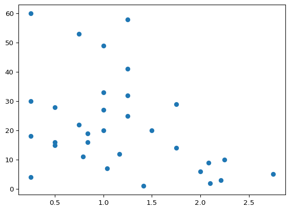
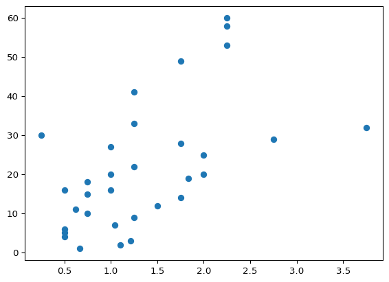
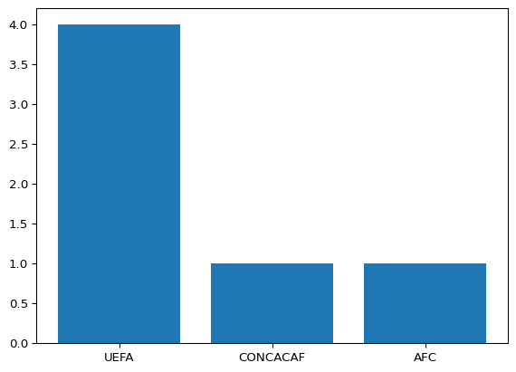
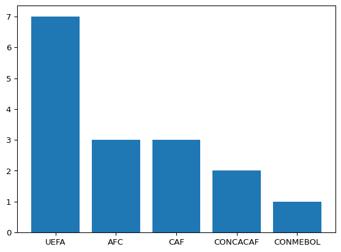
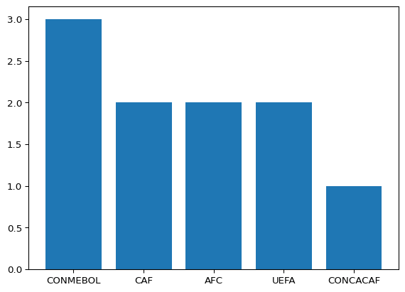

# Fifa World Cup Data Wrangling


``` python
import pandas as pd 
import statsmodels.api as sm
import seaborn as sns
import re
import matplotlib.pyplot as plt
import statsmodels.formula.api as smf
import numpy as np
```

``` python
data = pd.read_csv('~/Documents/Data_Wrangling/Fifa_world_cup_matches.csv')

data.columns

data.info

data.info(verbose=True)
```

    <class 'pandas.core.frame.DataFrame'>
    RangeIndex: 64 entries, 0 to 63
    Data columns (total 88 columns):
     #   Column                                                 Non-Null Count  Dtype 
    ---  ------                                                 --------------  ----- 
     0   team1                                                  64 non-null     object
     1   team2                                                  64 non-null     object
     2   possession team1                                       64 non-null     object
     3   possession team2                                       64 non-null     object
     4   possession in contest                                  64 non-null     object
     5   number of goals team1                                  64 non-null     int64 
     6   number of goals team2                                  64 non-null     int64 
     7   date                                                   64 non-null     object
     8   hour                                                   64 non-null     object
     9   category                                               64 non-null     object
     10  total attempts team1                                   64 non-null     int64 
     11  total attempts team2                                   64 non-null     int64 
     12  conceded team1                                         64 non-null     int64 
     13  conceded team2                                         64 non-null     int64 
     14  goal inside the penalty area team1                     64 non-null     int64 
     15  goal inside the penalty area team2                     64 non-null     int64 
     16  goal outside the penalty area team1                    64 non-null     int64 
     17  goal outside the penalty area team2                    64 non-null     int64 
     18  assists team1                                          64 non-null     int64 
     19  assists team2                                          64 non-null     int64 
     20  on target attempts team1                               64 non-null     int64 
     21  on target attempts team2                               64 non-null     int64 
     22  off target attempts team1                              64 non-null     int64 
     23  off target attempts team2                              64 non-null     int64 
     24  attempts inside the penalty area team1                 64 non-null     int64 
     25  attempts inside the penalty area  team2                64 non-null     int64 
     26  attempts outside the penalty area  team1               64 non-null     int64 
     27  attempts outside the penalty area  team2               64 non-null     int64 
     28  left channel team1                                     64 non-null     int64 
     29  left channel team2                                     64 non-null     int64 
     30  left inside channel team1                              64 non-null     int64 
     31  left inside channel team2                              64 non-null     int64 
     32  central channel team1                                  64 non-null     int64 
     33  central channel team2                                  64 non-null     int64 
     34  right inside channel team1                             64 non-null     int64 
     35  right inside channel team2                             64 non-null     int64 
     36  right channel team1                                    64 non-null     int64 
     37  right channel team2                                    64 non-null     int64 
     38  total offers to receive team1                          64 non-null     int64 
     39  total offers to receive team2                          64 non-null     int64 
     40  inbehind offers to receive team1                       64 non-null     int64 
     41  inbehind offers to receive team2                       64 non-null     int64 
     42  inbetween offers to receive team1                      64 non-null     int64 
     43  inbetween offers to receive team2                      64 non-null     int64 
     44  infront offers to receive team1                        64 non-null     int64 
     45  infront offers to receive team2                        64 non-null     int64 
     46  receptions between midfield and defensive lines team1  64 non-null     int64 
     47  receptions between midfield and defensive lines team2  64 non-null     int64 
     48  attempted line breaks team1                            64 non-null     int64 
     49  attempted line breaks team2                            64 non-null     int64 
     50  completed line breaksteam1                             64 non-null     int64 
     51  completed line breaks team2                            64 non-null     int64 
     52  attempted defensive line breaks team1                  64 non-null     int64 
     53  attempted defensive line breaks team2                  64 non-null     int64 
     54  completed defensive line breaksteam1                   64 non-null     int64 
     55  completed defensive line breaks team2                  64 non-null     int64 
     56  yellow cards team1                                     64 non-null     int64 
     57  yellow cards team2                                     64 non-null     int64 
     58  red cards team1                                        64 non-null     int64 
     59  red cards team2                                        64 non-null     int64 
     60  fouls against team1                                    64 non-null     int64 
     61  fouls against team2                                    64 non-null     int64 
     62  offsides team1                                         64 non-null     int64 
     63  offsides team2                                         64 non-null     int64 
     64  passes team1                                           64 non-null     int64 
     65  passes team2                                           64 non-null     int64 
     66  passes completed team1                                 64 non-null     int64 
     67  passes completed team2                                 64 non-null     int64 
     68  crosses team1                                          64 non-null     int64 
     69  crosses team2                                          64 non-null     int64 
     70  crosses completed team1                                64 non-null     int64 
     71  crosses completed team2                                64 non-null     int64 
     72  switches of play completed team1                       64 non-null     int64 
     73  switches of play completed team2                       64 non-null     int64 
     74  corners team1                                          64 non-null     int64 
     75  corners team2                                          64 non-null     int64 
     76  free kicks team1                                       64 non-null     int64 
     77  free kicks team2                                       64 non-null     int64 
     78  penalties scored team1                                 64 non-null     int64 
     79  penalties scored team2                                 64 non-null     int64 
     80  goal preventions team1                                 64 non-null     int64 
     81  goal preventions team2                                 64 non-null     int64 
     82  own goals team1                                        64 non-null     int64 
     83  own goals team2                                        64 non-null     int64 
     84  forced turnovers team1                                 64 non-null     int64 
     85  forced turnovers team2                                 64 non-null     int64 
     86  defensive pressures applied team1                      64 non-null     int64 
     87  defensive pressures applied team2                      64 non-null     int64 
    dtypes: int64(80), object(8)
    memory usage: 44.1+ KB

``` python
pd.set_option('display.max_columns', None)
data.head()
data.columns

data.head()
data2 = pd.read_csv('~/Documents/Data_Wrangling/fifa_mens_rank.csv')

data2.columns

data2.head()
```

<div>
<style scoped>
    .dataframe tbody tr th:only-of-type {
        vertical-align: middle;
    }
&#10;    .dataframe tbody tr th {
        vertical-align: top;
    }
&#10;    .dataframe thead th {
        text-align: right;
    }
</style>

|  | date | semester | rank | team | acronym | total.points | previous.points | diff.points |
|----|----|----|----|----|----|----|----|----|
| 0 | 2024 | 2 | 1 | Argentina | ARG | 1867.25 | 1883.50 | -16.25 |
| 1 | 2024 | 2 | 2 | France | FRA | 1859.78 | 1859.85 | -0.07 |
| 2 | 2024 | 2 | 3 | Spain | ESP | 1853.27 | 1844.33 | 8.94 |
| 3 | 2024 | 2 | 4 | England | ENG | 1813.81 | 1807.83 | 5.98 |
| 4 | 2024 | 2 | 5 | Brazil | BRA | 1775.85 | 1784.37 | -8.52 |

</div>

Below I am cleaning the possession columns to be integers instead of
strings with % signs.

``` python
data['possession team1'] = data['possession team1'].str.replace('%','', regex=False).astype(int)
data['possession team2'] = data['possession team2'].str.replace('%','', regex=False).astype(int)
data['possession in contest'] = data['possession in contest'].str.replace('%','', regex=False).astype(int)

data.groupby(['team1', 'team2']).agg({'possession team1':['mean'], 'possession team2': ['mean']})
```

<div>
<style scoped>
    .dataframe tbody tr th:only-of-type {
        vertical-align: middle;
    }
&#10;    .dataframe tbody tr th {
        vertical-align: top;
    }
&#10;    .dataframe thead tr th {
        text-align: left;
    }
&#10;    .dataframe thead tr:last-of-type th {
        text-align: right;
    }
</style>

|               |                | possession team1 | possession team2 |
|---------------|----------------|------------------|------------------|
|               |                | mean             | mean             |
| team1         | team2          |                  |                  |
| ARGENTINA     | AUSTRALIA      | 53.0             | 35.0             |
|               | CROATIA        | 34.0             | 54.0             |
|               | FRANCE         | 46.0             | 40.0             |
|               | MEXICO         | 50.0             | 36.0             |
|               | SAUDI ARABIA   | 64.0             | 24.0             |
| ...           | ...            | ...              | ...              |
| TUNISIA       | FRANCE         | 30.0             | 56.0             |
| UNITED STATES | WALES          | 51.0             | 39.0             |
| URUGUAY       | KOREA REPUBLIC | 49.0             | 38.0             |
| WALES         | ENGLAND        | 33.0             | 58.0             |
|               | IRAN           | 51.0             | 33.0             |

<p>64 rows × 2 columns</p>
</div>

Below I am seprating the data into seperate dataframes for team1 and
team2.

``` python
Team1_col = [col for col in data if (re.search(r'team1',col )) or (col in ['date', 'hour', 'category'])]

Team1_col

Team1_data = data[Team1_col]

Team1_data['team1'] = Team1_data['team1'].str.title()

Team1_data

Team2_col = [col for col in data if (re.search(r'team2',col )) or (col in ['date', 'hour', 'category'])]

Team2_col

Team2_data = data[Team2_col]

Team2_data

Team2_data['team2'] = Team2_data['team2'].str.title()

Team2_data
```

    /var/folders/zz/15fj1hcs0f3b5c7flnzc1mr80000gn/T/ipykernel_7042/2242034230.py:7: SettingWithCopyWarning: 
    A value is trying to be set on a copy of a slice from a DataFrame.
    Try using .loc[row_indexer,col_indexer] = value instead

    See the caveats in the documentation: https://pandas.pydata.org/pandas-docs/stable/user_guide/indexing.html#returning-a-view-versus-a-copy
      Team1_data['team1'] = Team1_data['team1'].str.title()
    /var/folders/zz/15fj1hcs0f3b5c7flnzc1mr80000gn/T/ipykernel_7042/2242034230.py:19: SettingWithCopyWarning: 
    A value is trying to be set on a copy of a slice from a DataFrame.
    Try using .loc[row_indexer,col_indexer] = value instead

    See the caveats in the documentation: https://pandas.pydata.org/pandas-docs/stable/user_guide/indexing.html#returning-a-view-versus-a-copy
      Team2_data['team2'] = Team2_data['team2'].str.title()

<div>
<style scoped>
    .dataframe tbody tr th:only-of-type {
        vertical-align: middle;
    }
&#10;    .dataframe tbody tr th {
        vertical-align: top;
    }
&#10;    .dataframe thead th {
        text-align: right;
    }
</style>

|  | team2 | possession team2 | number of goals team2 | date | hour | category | total attempts team2 | conceded team2 | goal inside the penalty area team2 | goal outside the penalty area team2 | assists team2 | on target attempts team2 | off target attempts team2 | attempts inside the penalty area team2 | attempts outside the penalty area team2 | left channel team2 | left inside channel team2 | central channel team2 | right inside channel team2 | right channel team2 | total offers to receive team2 | inbehind offers to receive team2 | inbetween offers to receive team2 | infront offers to receive team2 | receptions between midfield and defensive lines team2 | attempted line breaks team2 | completed line breaks team2 | attempted defensive line breaks team2 | completed defensive line breaks team2 | yellow cards team2 | red cards team2 | fouls against team2 | offsides team2 | passes team2 | passes completed team2 | crosses team2 | crosses completed team2 | switches of play completed team2 | corners team2 | free kicks team2 | penalties scored team2 | goal preventions team2 | own goals team2 | forced turnovers team2 | defensive pressures applied team2 |
|----|----|----|----|----|----|----|----|----|----|----|----|----|----|----|----|----|----|----|----|----|----|----|----|----|----|----|----|----|----|----|----|----|----|----|----|----|----|----|----|----|----|----|----|----|----|
| 0 | Ecuador | 50 | 2 | 20 NOV 2022 | 17 : 00 | Group A | 6 | 0 | 2 | 0 | 1 | 3 | 3 | 4 | 2 | 8 | 7 | 6 | 4 | 6 | 532 | 127 | 187 | 218 | 8 | 155 | 99 | 13 | 7 | 2 | 0 | 15 | 4 | 480 | 409 | 14 | 4 | 9 | 3 | 17 | 1 | 5 | 0 | 72 | 279 |
| 1 | Iran | 19 | 2 | 21 NOV 2022 | 14 : 00 | Group B | 8 | 6 | 2 | 0 | 1 | 3 | 4 | 6 | 2 | 3 | 0 | 3 | 1 | 0 | 212 | 53 | 86 | 73 | 4 | 101 | 45 | 7 | 4 | 2 | 0 | 14 | 2 | 224 | 154 | 8 | 1 | 3 | 0 | 10 | 1 | 13 | 0 | 72 | 416 |
| 2 | Netherlands | 45 | 2 | 21 NOV 2022 | 17 : 00 | Group A | 9 | 0 | 2 | 0 | 1 | 3 | 5 | 5 | 4 | 11 | 2 | 2 | 7 | 20 | 506 | 117 | 191 | 198 | 14 | 162 | 96 | 22 | 10 | 1 | 0 | 13 | 1 | 438 | 374 | 25 | 8 | 6 | 7 | 14 | 0 | 15 | 0 | 73 | 251 |
| 3 | Wales | 39 | 1 | 21 NOV 2022 | 20 : 00 | Group B | 7 | 1 | 1 | 0 | 0 | 3 | 3 | 5 | 2 | 7 | 2 | 5 | 2 | 7 | 436 | 100 | 172 | 164 | 9 | 174 | 103 | 17 | 8 | 2 | 0 | 10 | 1 | 409 | 321 | 15 | 6 | 8 | 3 | 15 | 1 | 7 | 0 | 72 | 292 |
| 4 | Saudi Arabia | 24 | 2 | 22 NOV 2022 | 11 : 00 | Group C | 3 | 1 | 2 | 0 | 1 | 2 | 0 | 3 | 0 | 3 | 2 | 3 | 3 | 8 | 268 | 69 | 131 | 68 | 9 | 137 | 68 | 15 | 7 | 6 | 0 | 21 | 1 | 267 | 190 | 9 | 2 | 7 | 2 | 16 | 0 | 14 | 0 | 80 | 361 |
| ... | ... | ... | ... | ... | ... | ... | ... | ... | ... | ... | ... | ... | ... | ... | ... | ... | ... | ... | ... | ... | ... | ... | ... | ... | ... | ... | ... | ... | ... | ... | ... | ... | ... | ... | ... | ... | ... | ... | ... | ... | ... | ... | ... | ... | ... |
| 59 | France | 36 | 2 | 10 DEC 2022 | 20 : 00 | Quarter-final | 9 | 1 | 1 | 1 | 2 | 5 | 3 | 6 | 3 | 15 | 2 | 7 | 2 | 13 | 401 | 84 | 136 | 181 | 7 | 136 | 87 | 14 | 8 | 3 | 0 | 14 | 2 | 369 | 310 | 13 | 6 | 2 | 2 | 11 | 0 | 15 | 0 | 54 | 308 |
| 60 | Croatia | 54 | 0 | 13 DEC 2022 | 20 : 00 | Semi-final | 12 | 3 | 0 | 0 | 0 | 3 | 7 | 6 | 6 | 18 | 6 | 7 | 4 | 8 | 643 | 136 | 291 | 216 | 3 | 182 | 129 | 9 | 1 | 2 | 0 | 8 | 0 | 624 | 551 | 20 | 4 | 8 | 4 | 16 | 0 | 10 | 0 | 63 | 260 |
| 61 | Morocco | 55 | 0 | 14 DEC 2022 | 20 : 00 | Semi-final | 13 | 2 | 0 | 0 | 0 | 1 | 6 | 8 | 5 | 10 | 4 | 6 | 6 | 19 | 702 | 136 | 314 | 252 | 15 | 141 | 95 | 18 | 11 | 1 | 0 | 11 | 3 | 583 | 518 | 22 | 1 | 8 | 3 | 15 | 0 | 14 | 0 | 47 | 218 |
| 62 | Morocco | 45 | 1 | 17 DEC 2022 | 16 : 00 | Play-off for third place | 7 | 2 | 1 | 0 | 0 | 2 | 5 | 5 | 2 | 13 | 1 | 3 | 7 | 16 | 609 | 127 | 202 | 280 | 10 | 150 | 97 | 14 | 8 | 2 | 0 | 11 | 2 | 494 | 428 | 20 | 5 | 12 | 3 | 15 | 0 | 14 | 0 | 72 | 277 |
| 63 | France | 40 | 3 | 18 DEC 2022 | 16 : 00 | Final | 10 | 3 | 3 | 0 | 1 | 5 | 3 | 7 | 3 | 15 | 7 | 5 | 4 | 12 | 507 | 105 | 207 | 195 | 10 | 163 | 99 | 14 | 9 | 3 | 0 | 19 | 4 | 516 | 419 | 24 | 3 | 5 | 5 | 28 | 2 | 21 | 0 | 104 | 409 |

<p>64 rows × 45 columns</p>
</div>

Below I am converting the integer columns to mean stats for both
dataframes

``` python
int_cols_1 = Team1_data.select_dtypes(include = 'int64').columns

team1_mean_stats = Team1_data.groupby('team1', as_index=False)[int_cols_1].mean()

team1_mean_stats = team1_mean_stats.round(2)

team1_mean_stats

int_cols_2 = Team2_data.select_dtypes(include = 'int64').columns

team2_mean_stats = Team2_data.groupby('team2', as_index=False)[int_cols_2].mean()

team2_mean_stats = team2_mean_stats.round(2)

print(team2_mean_stats)
```

                 team2  possession team2  number of goals team2  \
    0        Argentina             55.50                   2.00   
    1        Australia             33.67                   1.00   
    2          Belgium             47.00                   0.00   
    3           Brazil             50.50                   0.50   
    4         Cameroon             46.00                   0.00   
    5           Canada             44.50                   0.50   
    6       Costa Rica             28.00                   0.50   
    7          Croatia             54.00                   0.33   
    8          Denmark             52.00                   0.50   
    9          Ecuador             44.50                   1.50   
    10         England             58.00                   3.00   
    11          France             44.00                   1.67   
    12         Germany             46.50                   2.50   
    13           Ghana             33.50                   2.50   
    14            Iran             26.00                   2.00   
    15           Japan             22.00                   2.00   
    16  Korea Republic             41.00                   0.50   
    17          Mexico             45.50                   1.00   
    18         Morocco             42.00                   1.25   
    19     Netherlands             45.00                   2.00   
    20          Poland             36.50                   0.50   
    21        Portugal             60.00                   0.50   
    22           Qatar             38.00                   0.00   
    23    Saudi Arabia             40.50                   1.00   
    24         Senegal             38.33                   1.67   
    25          Serbia             41.50                   1.50   
    26           Spain             73.00                   0.50   
    27     Switzerland             43.00                   1.33   
    28         Tunisia             33.00                   0.00   
    29   United States             46.33                   0.67   
    30         Uruguay             37.00                   1.00   
    31           Wales             39.00                   1.00   

        total attempts team2  conceded team2  goal inside the penalty area team2  \
    0                  20.00            1.00                                2.00   
    1                   5.67            2.00                                0.67   
    2                  15.00            0.00                                0.00   
    3                  19.50            1.00                                0.50   
    4                   7.00            1.00                                0.00   
    5                  15.00            2.50                                0.50   
    6                   2.00            3.50                                0.50   
    7                  11.33            1.33                                0.33   
    8                  12.00            1.50                                0.50   
    9                   9.50            0.50                                1.50   
    10                 17.00            0.00                                2.00   
    11                  9.33            1.67                                1.33   
    12                 21.00            1.50                                2.50   
    13                  8.00            2.50                                2.50   
    14                 14.50            3.00                                1.50   
    15                 10.00            1.00                                2.00   
    16                  8.00            2.00                                0.00   
    17                 14.50            1.50                                0.50   
    18                  9.50            1.25                                1.00   
    19                  9.00            0.00                                2.00   
    20                  9.50            1.50                                0.50   
    21                 11.50            1.50                                0.50   
    22                  6.00            2.00                                0.00   
    23                  9.50            1.50                                1.00   
    24                 12.33            1.67                                1.67   
    25                 10.00            2.50                                1.00   
    26                 13.50            1.00                                0.50   
    27                  9.33            3.00                                1.33   
    28                 11.00            0.00                                0.00   
    29                 13.33            1.00                                0.67   
    30                 11.00            1.00                                1.00   
    31                  7.00            1.00                                1.00   

        goal outside the penalty area team2  assists team2  \
    0                                  0.00           1.50   
    1                                  0.00           0.67   
    2                                  0.00           0.00   
    3                                  0.00           0.50   
    4                                  0.00           0.00   
    5                                  0.00           0.50   
    6                                  0.00           0.50   
    7                                  0.00           0.33   
    8                                  0.00           0.50   
    9                                  0.00           0.50   
    10                                 1.00           2.00   
    11                                 0.33           1.00   
    12                                 0.00           2.50   
    13                                 0.00           2.00   
    14                                 0.50           1.00   
    15                                 0.00           1.00   
    16                                 0.50           0.00   
    17                                 0.50           0.50   
    18                                 0.25           0.75   
    19                                 0.00           1.00   
    20                                 0.00           0.00   
    21                                 0.00           0.50   
    22                                 0.00           0.00   
    23                                 0.00           0.50   
    24                                 0.00           0.67   
    25                                 0.50           1.50   
    26                                 0.00           0.50   
    27                                 0.00           1.00   
    28                                 0.00           0.00   
    29                                 0.00           0.67   
    30                                 0.00           0.50   
    31                                 0.00           0.00   

        on target attempts team2  off target attempts team2  \
    0                       9.50                       8.00   
    1                       1.67                       2.67   
    2                       4.00                       7.00   
    3                       8.50                       7.50   
    4                       3.00                       2.00   
    5                       3.00                       7.50   
    6                       0.50                       0.50   
    7                       3.00                       5.67   
    8                       2.50                       6.50   
    9                       4.00                       3.00   
    10                      7.00                       6.00   
    11                      4.33                       3.33   
    12                      7.50                      11.00   
    13                      3.00                       4.00   
    14                      4.50                       5.00   
    15                      3.00                       6.00   
    16                      3.00                       3.50   
    17                      5.50                       5.00   
    18                      2.25                       4.75   
    19                      3.00                       5.00   
    20                      2.00                       4.50   
    21                      3.50                       6.00   
    22                      4.00                       2.00   
    23                      3.50                       4.50   
    24                      3.67                       6.67   
    25                      3.00                       5.50   
    26                      3.00                       4.50   
    27                      2.67                       3.67   
    28                      1.00                       7.00   
    29                      4.67                       5.00   
    30                      5.00                       5.50   
    31                      3.00                       3.00   

        attempts inside the penalty area  team2  \
    0                                     13.00   
    1                                      3.33   
    2                                     12.00   
    3                                     13.00   
    4                                      6.00   
    5                                      9.00   
    6                                      0.50   
    7                                      6.33   
    8                                      8.00   
    9                                      6.00   
    10                                    13.00   
    11                                     5.67   
    12                                    15.50   
    13                                     4.50   
    14                                     6.50   
    15                                    10.00   
    16                                     3.50   
    17                                     5.50   
    18                                     5.75   
    19                                     5.00   
    20                                     7.50   
    21                                     6.00   
    22                                     2.00   
    23                                     6.00   
    24                                     8.33   
    25                                     6.00   
    26                                     8.00   
    27                                     5.67   
    28                                     6.00   
    29                                     8.33   
    30                                     6.50   
    31                                     5.00   

        attempts outside the penalty area  team2  left channel team2  \
    0                                       7.00               16.00   
    1                                       2.33               10.00   
    2                                       3.00               18.00   
    3                                       6.50               22.50   
    4                                       1.00                9.00   
    5                                       6.00               12.50   
    6                                       1.50                6.50   
    7                                       5.00               16.00   
    8                                       4.00               20.00   
    9                                       3.50                9.00   
    10                                      4.00               10.00   
    11                                      3.67               14.67   
    12                                      5.50               16.00   
    13                                      3.50                7.50   
    14                                      8.00                5.00   
    15                                      0.00                5.00   
    16                                      4.50               17.00   
    17                                      9.00               12.00   
    18                                      3.75                9.75   
    19                                      4.00               11.00   
    20                                      2.00               11.50   
    21                                      5.50               25.00   
    22                                      4.00               10.00   
    23                                      3.50               12.00   
    24                                      4.00               16.00   
    25                                      4.00               15.00   
    26                                      5.50               33.00   
    27                                      3.67               13.00   
    28                                      5.00                9.00   
    29                                      5.00               12.00   
    30                                      4.50               10.00   
    31                                      2.00                7.00   

        left inside channel team2  central channel team2  \
    0                        7.50                  10.00   
    1                        2.00                   3.67   
    2                        5.00                   7.00   
    3                        7.50                  10.50   
    4                       12.00                   3.00   
    5                        5.00                   5.50   
    6                        0.00                   2.00   
    7                        5.33                   7.33   
    8                        5.00                   3.50   
    9                        6.00                   4.00   
    10                       4.00                   7.00   
    11                       5.00                   5.67   
    12                       8.00                   8.50   
    13                       6.00                   5.00   
    14                       1.50                   5.00   
    15                       0.00                   3.00   
    16                       2.00                   3.50   
    17                       3.00                   2.00   
    18                       2.00                   3.50   
    19                       2.00                   2.00   
    20                       4.00                   4.00   
    21                       8.50                   6.50   
    22                       7.00                   5.00   
    23                       4.00                   4.00   
    24                       1.67                   2.67   
    25                       3.50                  10.00   
    26                       9.50                   7.00   
    27                       4.00                   4.33   
    28                       2.00                   2.00   
    29                       5.00                   4.00   
    30                       5.00                   8.50   
    31                       2.00                   5.00   

        right inside channel team2  right channel team2  \
    0                         8.00                21.50   
    1                         4.67                12.33   
    2                         4.00                 9.00   
    3                         7.50                16.50   
    4                         5.00                18.00   
    5                         4.50                16.50   
    6                         0.50                 2.50   
    7                         5.00                14.33   
    8                         5.00                22.00   
    9                         4.50                 5.00   
    10                       12.00                 9.00   
    11                        3.00                15.33   
    12                        7.50                11.50   
    13                        3.00                 5.00   
    14                        2.50                 3.50   
    15                        3.00                11.00   
    16                        4.50                20.00   
    17                        4.50                13.50   
    18                        4.50                12.75   
    19                        7.00                20.00   
    20                        3.50                11.50   
    21                        7.50                16.00   
    22                        4.00                 6.00   
    23                        5.00                11.50   
    24                        5.00                12.33   
    25                        4.00                 9.50   
    26                       15.00                25.50   
    27                        3.00                10.00   
    28                        3.00                 6.00   
    29                        6.67                13.33   
    30                        4.00                13.00   
    31                        2.00                 7.00   

        total offers to receive team2  inbehind offers to receive team2  \
    0                          775.50                            136.00   
    1                          467.00                            102.67   
    2                          581.00                            123.00   
    3                          690.00                            149.00   
    4                          561.00                            109.00   
    5                          587.00                            130.50   
    6                          339.50                             64.50   
    7                          662.00                            136.67   
    8                          627.50                            158.50   
    9                          536.50                            106.50   
    10                         777.00                            140.00   
    11                         512.67                             95.00   
    12                         593.50                            162.50   
    13                         424.00                             79.50   
    14                         277.50                             81.00   
    15                         346.00                            102.00   
    16                         549.00                            126.00   
    17                         432.50                            136.00   
    18                         561.25                            112.50   
    19                         506.00                            117.00   
    20                         398.50                             98.00   
    21                         760.00                            182.00   
    22                         574.00                            100.00   
    23                         464.50                            112.50   
    24                         436.67                            102.33   
    25                         498.50                             95.50   
    26                        1017.00                            178.00   
    27                         547.00                            117.00   
    28                         477.00                             89.00   
    29                         685.33                            147.00   
    30                         418.50                            116.00   
    31                         436.00                            100.00   

        inbetween offers to receive team2  infront offers to receive team2  \
    0                              280.00                           359.50   
    1                              170.67                           193.67   
    2                              181.00                           277.00   
    3                              283.50                           257.50   
    4                              248.00                           204.00   
    5                              263.00                           193.50   
    6                              140.50                           134.50   
    7                              245.00                           280.33   
    8                              263.50                           205.50   
    9                              231.50                           198.50   
    10                             310.00                           327.00   
    11                             185.00                           232.67   
    12                             224.50                           206.50   
    13                             172.00                           172.50   
    14                             117.50                            79.00   
    15                             146.00                            98.00   
    16                             249.00                           174.00   
    17                             154.50                           142.00   
    18                             229.00                           219.75   
    19                             191.00                           198.00   
    20                             162.50                           138.00   
    21                             201.50                           376.50   
    22                             245.00                           229.00   
    23                             197.50                           154.50   
    24                             166.00                           168.33   
    25                             223.00                           180.00   
    26                             282.50                           556.50   
    27                             215.00                           215.00   
    28                             204.00                           184.00   
    29                             286.67                           251.67   
    30                             156.00                           146.50   
    31                             172.00                           164.00   

        receptions between midfield and defensive lines team2  \
    0                                               14.00       
    1                                                7.67       
    2                                               12.00       
    3                                               10.00       
    4                                                5.00       
    5                                               10.50       
    6                                                1.00       
    7                                                8.67       
    8                                               17.00       
    9                                               10.00       
    10                                               9.00       
    11                                               9.33       
    12                                              18.50       
    13                                               5.00       
    14                                               6.50       
    15                                              10.00       
    16                                              11.50       
    17                                              11.00       
    18                                              10.00       
    19                                              14.00       
    20                                               7.00       
    21                                              15.50       
    22                                              11.00       
    23                                              15.50       
    24                                              10.33       
    25                                               7.50       
    26                                              22.00       
    27                                               7.33       
    28                                               7.00       
    29                                              13.33       
    30                                              10.00       
    31                                               9.00       

        attempted line breaks team2  completed line breaks team2  \
    0                        208.50                       155.00   
    1                        150.00                        89.00   
    2                        177.00                       115.00   
    3                        183.00                       133.00   
    4                        182.00                       103.00   
    5                        188.50                       128.50   
    6                        136.50                        71.50   
    7                        194.33                       125.67   
    8                        207.00                       152.00   
    9                        155.00                        91.50   
    10                       167.00                       131.00   
    11                       145.67                        95.00   
    12                       168.00                       121.00   
    13                       136.00                        77.00   
    14                       143.00                        68.50   
    15                       113.00                        70.00   
    16                       186.50                       116.50   
    17                       162.50                        93.50   
    18                       140.75                        91.50   
    19                       162.00                        96.00   
    20                       153.00                        89.50   
    21                       172.50                       120.50   
    22                       161.00                       107.00   
    23                       171.00                       110.50   
    24                       165.33                        94.33   
    25                       162.00                       106.50   
    26                       204.50                       149.00   
    27                       165.67                       100.67   
    28                       174.00                        85.00   
    29                       171.67                       115.67   
    30                       168.00                       105.00   
    31                       174.00                       103.00   

        attempted defensive line breaks team2  \
    0                                   24.50   
    1                                   15.33   
    2                                   26.00   
    3                                   17.00   
    4                                   16.00   
    5                                   19.00   
    6                                    7.50   
    7                                   15.67   
    8                                   22.00   
    9                                   17.50   
    10                                  13.00   
    11                                  12.67   
    12                                  25.50   
    13                                  12.00   
    14                                  15.50   
    15                                  17.00   
    16                                  18.50   
    17                                  23.00   
    18                                  14.75   
    19                                  22.00   
    20                                  16.00   
    21                                  22.00   
    22                                  15.00   
    23                                  21.00   
    24                                  18.00   
    25                                  18.50   
    26                                  29.00   
    27                                  18.00   
    28                                  17.00   
    29                                  23.33   
    30                                  20.50   
    31                                  17.00   

        completed defensive line breaks team2  yellow cards team2  \
    0                                   13.50                4.50   
    1                                    8.00                1.67   
    2                                   14.00                1.00   
    3                                    9.50                2.50   
    4                                    4.00                1.00   
    5                                    9.50                2.00   
    6                                    0.50                2.50   
    7                                    7.00                1.33   
    8                                   16.00                1.50   
    9                                    8.50                1.50   
    10                                   8.00                0.00   
    11                                   7.00                2.00   
    12                                  16.00                1.50   
    13                                   4.50                3.00   
    14                                   7.00                2.00   
    15                                  11.00                0.00   
    16                                  11.00                1.00   
    17                                  10.50                2.50   
    18                                   8.50                1.00   
    19                                  10.00                1.00   
    20                                   7.00                1.50   
    21                                  15.00                0.50   
    22                                  10.00                0.00   
    23                                  13.00                4.00   
    24                                   9.33                1.67   
    25                                   9.00                2.50   
    26                                  20.00                0.50   
    27                                   6.33                2.33   
    28                                   6.00                1.00   
    29                                  12.67                0.33   
    30                                  12.50                3.50   
    31                                   8.00                2.00   

        red cards team2  fouls against team2  offsides team2  passes team2  \
    0               0.0                14.50            1.00        732.50   
    1               0.0                13.67            0.00        416.67   
    2               0.0                 9.00            0.00        596.00   
    3               0.0                19.00            2.00        621.50   
    4               0.0                10.00            2.00        500.00   
    5               0.0                 9.50            2.00        479.50   
    6               0.0                10.50            4.50        337.50   
    7               0.0                11.67            0.33        675.33   
    8               0.0                 9.50            2.00        593.50   
    9               0.0                13.50            4.00        452.50   
    10              0.0                 9.00            1.00        588.00   
    11              0.0                13.00            2.67        507.00   
    12              0.0                10.00            4.00        539.50   
    13              0.0                14.00            1.00        356.50   
    14              0.0                12.00            2.00        259.50   
    15              0.0                14.00            4.00        261.00   
    16              0.0                11.50            2.50        483.50   
    17              0.0                18.50            5.00        384.00   
    18              0.0                12.50            3.00        444.50   
    19              0.0                13.00            1.00        438.00   
    20              0.0                12.00            0.50        394.00   
    21              0.0                10.00            3.50        642.00   
    22              0.0                 9.00            0.00        459.00   
    23              0.0                18.00            0.50        413.50   
    24              0.0                11.67            2.00        391.00   
    25              0.0                12.50            2.00        458.00   
    26              0.0                10.00            3.00       1055.50   
    27              0.0                13.33            1.33        467.67   
    28              0.0                10.00            1.00        387.00   
    29              0.0                10.00            1.33        488.00   
    30              0.0                13.50            1.00        418.00   
    31              0.0                10.00            1.00        409.00   

        passes completed team2  crosses team2  crosses completed team2  \
    0                   662.50          19.00                     4.50   
    1                   339.67          15.67                     2.67   
    2                   531.00          24.00                     8.00   
    3                   558.00          26.50                     7.00   
    4                   424.00          20.00                     4.00   
    5                   408.00          17.00                     5.50   
    6                   270.50           5.00                     0.00   
    7                   589.00          24.67                     5.67   
    8                   520.00          25.00                     4.50   
    9                   377.00          18.00                     4.00   
    10                  529.00          17.00                     7.00   
    11                  431.67          19.00                     4.67   
    12                  471.00          25.50                     6.50   
    13                  293.00          12.50                     3.50   
    14                  178.00          17.00                     2.50   
    15                  207.00          16.00                     3.00   
    16                  413.00          16.50                     2.00   
    17                  311.50          25.50                     5.00   
    18                  382.25          14.50                     2.75   
    19                  374.00          25.00                     8.00   
    20                  316.00          14.00                     4.50   
    21                  566.50          27.50                     6.50   
    22                  394.00          16.00                     4.00   
    23                  342.00          16.50                     3.00   
    24                  321.00          17.67                     4.67   
    25                  387.00          18.00                     3.50   
    26                  979.50          23.50                     3.00   
    27                  392.00          13.00                     2.67   
    28                  302.00          13.00                     3.00   
    29                  422.67          21.67                     2.00   
    30                  333.50          16.50                     4.50   
    31                  321.00          15.00                     6.00   

        switches of play completed team2  corners team2  free kicks team2  \
    0                               7.50           8.50             17.50   
    1                               5.00           2.00             11.67   
    2                               4.00           4.00             11.00   
    3                               3.50           9.00             19.50   
    4                               8.00           5.00             14.00   
    5                               6.50           3.00             12.00   
    6                               4.00           0.00             16.50   
    7                               7.33           4.67             16.33   
    8                              11.50           5.00              8.50   
    9                               5.50           4.00             16.50   
    10                              6.00           6.00             17.00   
    11                              3.33           5.00             18.67   
    12                              3.50           9.50             11.00   
    13                              2.50           4.00             14.50   
    14                              4.00           3.50             10.50   
    15                              2.00           6.00             10.00   
    16                             11.00           3.50              8.00   
    17                              3.00           5.00             19.50   
    18                             11.00           2.25             15.25   
    19                              6.00           7.00             14.00   
    20                              3.00           3.00             13.50   
    21                             10.00           6.50             13.50   
    22                             10.00           2.00             24.00   
    23                             10.00           3.50             16.50   
    24                              7.33           5.33             16.33   
    25                              5.50           3.50              8.00   
    26                              8.50           5.00             15.50   
    27                              4.67           3.00             15.33   
    28                              1.00           9.00             10.00   
    29                              5.00           5.67             11.67   
    30                              4.00           2.00             16.50   
    31                              8.00           3.00             15.00   

        penalties scored team2  goal preventions team2  own goals team2  \
    0                     0.50                    4.50             0.00   
    1                     0.00                   16.33             0.00   
    2                     0.00                   11.00             0.00   
    3                     0.00                    8.00             0.00   
    4                     0.00                    8.00             0.00   
    5                     0.00                   11.00             0.00   
    6                     0.00                   15.50             0.00   
    7                     0.00                    9.67             0.00   
    8                     0.00                   14.50             0.00   
    9                     0.50                    3.50             0.00   
    10                    0.00                    8.00             0.00   
    11                    0.67                   14.00             0.00   
    12                    0.00                    7.50             0.00   
    13                    0.00                   16.00             0.00   
    14                    0.50                   11.00             0.00   
    15                    0.00                   26.00             0.00   
    16                    0.00                   14.00             0.00   
    17                    0.00                    7.50             0.00   
    18                    0.00                   11.25             0.25   
    19                    0.00                   15.00             0.00   
    20                    0.50                   15.50             0.00   
    21                    0.00                   11.00             0.00   
    22                    0.00                   14.00             0.00   
    23                    0.00                   11.50             0.00   
    24                    0.33                    9.00             0.00   
    25                    0.00                   18.50             0.00   
    26                    0.00                    6.00             0.00   
    27                    0.00                   11.33             0.00   
    28                    0.00                   11.00             0.00   
    29                    0.00                    9.00             0.00   
    30                    0.00                   11.50             0.00   
    31                    1.00                    7.00             0.00   

        forced turnovers team2  defensive pressures applied team2  
    0                    63.50                             232.00  
    1                    72.33                             347.33  
    2                    68.00                             346.00  
    3                    65.50                             324.50  
    4                    79.00                             316.00  
    5                    59.50                             318.00  
    6                    71.00                             439.50  
    7                    73.67                             261.67  
    8                    67.50                             221.50  
    9                    62.00                             279.00  
    10                   56.00                             167.00  
    11                   79.33                             306.33  
    12                   89.00                             308.50  
    13                   78.50                             325.00  
    14                   78.00                             346.00  
    15                   87.00                             487.00  
    16                   67.50                             280.00  
    17                   77.50                             278.00  
    18                   67.25                             294.75  
    19                   73.00                             251.00  
    20                   67.00                             293.50  
    21                   47.00                             199.00  
    22                   52.00                             322.00  
    23                   66.50                             267.00  
    24                   67.67                             271.33  
    25                   76.00                             286.00  
    26                   57.50                             183.50  
    27                   72.00                             279.00  
    28                   73.00                             287.00  
    29                   70.67                             302.67  
    30                   82.50                             327.50  
    31                   72.00                             292.00  

Just cleaning up the column names for merging later

``` python
team1_mean_stats = team1_mean_stats.rename(columns = lambda s: s.replace('team1', 'Team'))

print(team1_mean_stats)

team1_mean_stats.columns = team1_mean_stats.columns.str.replace(' Team','', regex=False)

print(team1_mean_stats)

team2_mean_stats = team2_mean_stats.rename(columns = lambda s: s.replace('team2', 'Team'))

team2_mean_stats.columns = team2_mean_stats.columns.str.replace(' Team','', regex=False)

print(team2_mean_stats)
```

                  Team  possession Team  number of goals Team  \
    0        Argentina            49.40                  2.20   
    1        Australia            24.00                  1.00   
    2          Belgium            51.00                  0.50   
    3           Brazil            50.33                  2.33   
    4         Cameroon            34.50                  2.00   
    5           Canada            52.00                  1.00   
    6       Costa Rica            27.00                  2.00   
    7          Croatia            43.50                  1.75   
    8          Denmark            55.00                  0.00   
    9          Ecuador            51.00                  1.00   
    10         England            57.75                  2.50   
    11          France            45.50                  2.75   
    12         Germany            65.00                  1.00   
    13           Ghana            46.00                  0.00   
    14            Iran            42.00                  0.00   
    15           Japan            32.33                  1.00   
    16  Korea Republic            43.50                  2.00   
    17          Mexico            54.00                  0.00   
    18         Morocco            25.33                  0.33   
    19     Netherlands            45.00                  2.00   
    20          Poland            27.00                  1.00   
    21        Portugal            50.33                  3.67   
    22           Qatar            42.00                  0.50   
    23    Saudi Arabia            29.00                  1.00   
    24         Senegal            44.00                  0.00   
    25          Serbia            45.00                  2.00   
    26           Spain            65.00                  4.00   
    27     Switzerland            43.00                  1.00   
    28         Tunisia            40.00                  0.50   
    29   United States            51.00                  1.00   
    30         Uruguay            49.00                  0.00   
    31           Wales            42.00                  0.00   

        total attempts Team  conceded Team  goal inside the penalty area Team  \
    0                 12.80           1.20                               2.00   
    1                  8.00           0.00                               1.00   
    2                  9.50           1.00                               0.50   
    3                 17.00           0.33                               2.33   
    4                 10.00           1.50                               2.00   
    5                  5.00           2.00                               0.00   
    6                  8.00           4.00                               2.00   
    7                 11.75           0.75                               1.50   
    8                 11.00           0.00                               0.00   
    9                  8.00           2.00                               1.00   
    10                10.75           1.00                               2.50   
    11                18.25           0.75                               2.75   
    12                25.00           2.00                               1.00   
    13                 9.00           2.00                               0.00   
    14                 6.00           1.00                               0.00   
    15                10.67           1.00                               0.67   
    16                16.50           2.00                               2.00   
    17                13.00           0.00                               0.00   
    18                 7.67           0.00                               0.33   
    19                 7.75           1.00                               1.75   
    20                 6.00           1.00                               1.00   
    21                13.00           1.00                               3.33   
    22                 7.50           2.50                               0.50   
    23                10.00           2.00                               1.00   
    24                14.00           2.00                               0.00   
    25                11.00           3.00                               2.00   
    26                12.00           0.50                               4.00   
    27                 8.00           0.00                               1.00   
    28                 9.00           0.50                               0.00   
    29                 6.00           1.00                               1.00   
    30                10.00           0.00                               0.00   
    31                 8.50           2.50                               0.00   

        goal outside the penalty area Team  assists Team  on target attempts Team  \
    0                                 0.20          1.00                     5.80   
    1                                 0.00          1.00                     4.00   
    2                                 0.00          0.50                     3.50   
    3                                 0.00          1.67                     8.00   
    4                                 0.00          2.00                     5.50   
    5                                 0.00          0.00                     0.00   
    6                                 0.00          0.00                     6.00   
    7                                 0.25          1.75                     4.75   
    8                                 0.00          0.00                     4.00   
    9                                 0.00          1.00                     4.00   
    10                                0.00          2.25                     5.00   
    11                                0.00          2.25                     5.50   
    12                                0.00          0.00                     9.00   
    13                                0.00          0.00                     4.00   
    14                                0.00          0.00                     2.00   
    15                                0.33          1.00                     3.33   
    16                                0.00          1.50                     6.00   
    17                                0.00          0.00                     4.00   
    18                                0.00          0.33                     2.67   
    19                                0.25          1.75                     3.25   
    20                                0.00          0.50                     1.50   
    21                                0.33          2.33                     6.00   
    22                                0.00          0.50                     1.00   
    23                                0.00          1.00                     2.00   
    24                                0.00          0.00                     3.00   
    25                                0.00          1.00                     4.00   
    26                                0.00          2.50                     5.00   
    27                                0.00          1.00                     3.00   
    28                                0.50          0.50                     3.50   
    29                                0.00          1.00                     1.00   
    30                                0.00          0.00                     0.00   
    31                                0.00          0.00                     2.00   

        off target attempts Team  attempts inside the penalty area Team  \
    0                       5.20                                   8.00   
    1                       2.00                                   3.00   
    2                       6.00                                   5.50   
    3                       6.33                                  10.33   
    4                       3.00                                   7.00   
    5                       4.00                                   4.00   
    6                       1.00                                   6.00   
    7                       4.75                                   7.00   
    8                       4.00                                   7.00   
    9                       3.00                                   5.00   
    10                      3.75                                   7.25   
    11                      8.00                                  14.00   
    12                     11.00                                  15.00   
    13                      4.00                                   4.00   
    14                      4.00                                   5.00   
    15                      3.33                                   5.33   
    16                      6.00                                  10.50   
    17                      5.00                                  10.00   
    18                      3.00                                   3.67   
    19                      3.00                                   5.00   
    20                      2.50                                   5.00   
    21                      4.00                                   6.67   
    22                      6.00                                   3.00   
    23                      8.00                                   6.00   
    24                      8.00                                   7.00   
    25                      6.00                                  10.00   
    26                      6.00                                   7.50   
    27                      4.00                                   6.00   
    28                      3.50                                   5.50   
    29                      4.00                                   4.00   
    30                      6.00                                   7.00   
    31                      3.50                                   3.00   

        attempts outside the penalty area  Team  left channel Team  \
    0                                      4.80              11.60   
    1                                      5.00               9.00   
    2                                      4.00               9.00   
    3                                      6.67              17.67   
    4                                      3.00               6.50   
    5                                      1.00              22.00   
    6                                      2.00               7.00   
    7                                      4.75              17.25   
    8                                      4.00              17.00   
    9                                      3.00              13.00   
    10                                     3.50              14.00   
    11                                     4.25              17.25   
    12                                    10.00              24.00   
    13                                     5.00              12.00   
    14                                     1.00              12.00   
    15                                     5.33              14.67   
    16                                     6.00              15.50   
    17                                     3.00              20.00   
    18                                     4.00               7.67   
    19                                     2.75              12.00   
    20                                     1.00               6.50   
    21                                     6.33              16.33   
    22                                     4.50              11.00   
    23                                     4.00               5.00   
    24                                     7.00              12.00   
    25                                     1.00              17.00   
    26                                     4.50              21.00   
    27                                     2.00              19.00   
    28                                     3.50              11.50   
    29                                     2.00              14.00   
    30                                     3.00              13.00   
    31                                     5.50              12.50   

        left inside channel Team  central channel Team  right inside channel Team  \
    0                       6.20                  6.60                       5.20   
    1                       2.00                  2.00                       1.00   
    2                       5.50                  4.00                       3.00   
    3                       8.67                  6.67                       6.33   
    4                       5.50                  4.50                       4.00   
    5                       4.00                  2.00                       6.00   
    6                       5.00                  3.00                       1.00   
    7                       5.50                  2.75                       3.00   
    8                       4.00                  7.00                       6.00   
    9                       3.00                  1.00                       6.00   
    10                      4.75                  3.75                       3.00   
    11                      6.50                  3.00                       5.00   
    12                      9.00                 14.00                       5.00   
    13                      5.00                  8.00                       4.00   
    14                      2.00                  5.00                       3.00   
    15                      5.00                  5.33                       3.67   
    16                      6.00                  5.50                       5.00   
    17                      6.00                  1.00                       3.00   
    18                      1.00                  3.33                       1.00   
    19                      6.50                  5.75                       6.25   
    20                      2.00                  2.50                       5.00   
    21                      6.00                  5.67                       6.33   
    22                      2.50                  2.50                       3.00   
    23                      3.00                  4.00                       3.00   
    24                      4.00                  2.00                       4.00   
    25                      6.00                  4.00                       4.00   
    26                      3.50                  5.00                       3.50   
    27                      2.00                 11.00                       6.00   
    28                      5.50                  5.50                       3.00   
    29                      5.00                  4.00                       4.00   
    30                      4.00                  4.00                       6.00   
    31                      2.00                  5.00                       5.50   

        right channel Team  total offers to receive Team  \
    0                11.60                        608.80   
    1                11.00                        302.00   
    2                 7.50                        675.00   
    3                15.33                        684.00   
    4                12.00                        408.00   
    5                11.00                        703.00   
    6                 1.00                        344.00   
    7                12.25                        604.00   
    8                18.00                        681.00   
    9                 6.00                        453.00   
    10               11.25                        798.00   
    11               14.25                        554.75   
    12               21.00                        865.00   
    13               12.00                        597.00   
    14                4.00                        492.00   
    15               11.00                        568.67   
    16               17.00                        582.50   
    17               27.00                        547.00   
    18                7.33                        425.00   
    19               14.25                        635.75   
    20                8.00                        378.00   
    21                9.67                        709.33   
    22               10.00                        515.50   
    23               11.00                        337.00   
    24               13.00                        502.00   
    25               10.00                        577.00   
    26                8.50                        859.00   
    27               16.00                        609.00   
    28               10.50                        545.50   
    29               11.00                        725.00   
    30               14.00                        566.00   
    31                8.50                        555.00   

        inbehind offers to receive Team  inbetween offers to receive Team  \
    0                            125.20                            227.40   
    1                             88.00                            114.00   
    2                            129.50                            239.50   
    3                            149.00                            250.00   
    4                             95.50                            146.50   
    5                            189.00                            211.00   
    6                            100.00                            156.00   
    7                            127.50                            260.50   
    8                            152.00                            276.00   
    9                             83.00                            174.00   
    10                           147.50                            316.00   
    11                           115.25                            178.50   
    12                           199.00                            366.00   
    13                           154.00                            247.00   
    14                            94.00                            223.00   
    15                           136.67                            210.33   
    16                           134.00                            210.00   
    17                           128.00                            202.00   
    18                            92.33                            173.00   
    19                           119.00                            266.75   
    20                           101.00                            145.00   
    21                           148.00                            292.00   
    22                           112.50                            217.00   
    23                           100.00                            162.00   
    24                           123.00                            230.00   
    25                            92.00                            214.00   
    26                           135.00                            344.00   
    27                           153.00                            256.00   
    28                           132.50                            233.00   
    29                           149.00                            336.00   
    30                           157.00                            155.00   
    31                           103.00                            212.00   

        infront offers to receive Team  \
    0                           256.20   
    1                           100.00   
    2                           306.00   
    3                           285.00   
    4                           166.00   
    5                           303.00   
    6                            88.00   
    7                           216.00   
    8                           253.00   
    9                           196.00   
    10                          334.50   
    11                          261.00   
    12                          300.00   
    13                          196.00   
    14                          175.00   
    15                          221.67   
    16                          238.50   
    17                          217.00   
    18                          159.67   
    19                          250.00   
    20                          132.00   
    21                          269.33   
    22                          186.00   
    23                           75.00   
    24                          149.00   
    25                          271.00   
    26                          380.00   
    27                          200.00   
    28                          180.00   
    29                          240.00   
    30                          254.00   
    31                          240.00   

        receptions between midfield and defensive lines Team  \
    0                                               17.20      
    1                                                8.00      
    2                                                6.00      
    3                                               14.67      
    4                                               12.00      
    5                                                8.00      
    6                                               10.00      
    7                                               14.25      
    8                                               14.00      
    9                                                2.00      
    10                                              11.25      
    11                                              14.75      
    12                                              19.00      
    13                                               8.00      
    14                                               9.00      
    15                                               7.67      
    16                                              13.50      
    17                                              20.00      
    18                                               6.67      
    19                                               8.25      
    20                                               8.00      
    21                                              13.33      
    22                                               7.00      
    23                                               6.00      
    24                                              15.00      
    25                                               7.00      
    26                                              19.50      
    27                                              13.00      
    28                                              11.00      
    29                                              12.00      
    30                                               4.00      
    31                                               7.00      

        attempted line breaks Team  completed line breaksTeam  \
    0                       178.40                     120.80   
    1                       166.00                      81.00   
    2                       162.00                     111.00   
    3                       180.33                     131.00   
    4                       158.50                      85.00   
    5                       153.00                      91.00   
    6                       154.00                     103.00   
    7                       200.25                     144.25   
    8                       190.00                     136.00   
    9                       146.00                      77.00   
    10                      194.25                     140.50   
    11                      157.00                     109.00   
    12                      241.00                     185.00   
    13                      188.00                     111.00   
    14                      195.00                     102.00   
    15                      163.67                      89.33   
    16                      170.00                     117.50   
    17                      170.00                     117.00   
    18                      144.67                      76.67   
    19                      177.00                     126.25   
    20                      133.50                      75.00   
    21                      177.67                     119.67   
    22                      155.00                     101.50   
    23                      178.00                      86.00   
    24                      151.00                      89.00   
    25                      157.00                      95.00   
    26                      231.00                     189.50   
    27                      178.00                     123.00   
    28                      176.50                     102.50   
    29                      199.00                     146.00   
    30                      146.00                      88.00   
    31                      156.00                      92.00   

        attempted defensive line breaks Team  completed defensive line breaksTeam  \
    0                                  24.00                                13.60   
    1                                  17.00                                 7.00   
    2                                  13.00                                 4.50   
    3                                  19.00                                12.67   
    4                                  19.00                                 9.50   
    5                                  21.00                                 8.00   
    6                                  13.00                                 7.00   
    7                                  21.50                                12.25   
    8                                  21.00                                12.00   
    9                                  10.00                                 2.00   
    10                                 19.25                                12.00   
    11                                 21.50                                15.25   
    12                                 23.00                                20.00   
    13                                 13.00                                 5.00   
    14                                 23.00                                 8.00   
    15                                 19.00                                 7.67   
    16                                 17.50                                12.50   
    17                                 32.00                                19.00   
    18                                 15.00                                 5.33   
    19                                 13.50                                 6.75   
    20                                 13.50                                 6.50   
    21                                 17.67                                11.00   
    22                                 11.00                                 5.50   
    23                                 17.00                                 5.00   
    24                                 22.00                                15.00   
    25                                 10.00                                 5.00   
    26                                 26.50                                17.50   
    27                                 21.00                                13.00   
    28                                 22.00                                 9.00   
    29                                 23.00                                15.00   
    30                                 16.00                                 7.00   
    31                                 10.50                                 4.50   

        yellow cards Team  red cards Team  fouls against Team  offsides Team  \
    0                1.40            0.00               14.20           4.20   
    1                2.00            0.00               11.00           1.00   
    2                2.00            0.00               10.50           1.50   
    3                0.33            0.00                8.33           1.33   
    4                3.50            0.50               11.00           0.00   
    5                4.00            0.00               14.00           4.00   
    6                1.00            0.00                3.00           4.00   
    7                1.00            0.00               13.75           2.50   
    8                2.00            0.00                9.00           1.00   
    9                0.00            0.00               23.00           0.00   
    10               0.25            0.00               11.00           1.00   
    11               0.50            0.00                7.50           2.00   
    12               0.00            0.00                6.00           4.00   
    13               2.00            0.00               18.00           2.00   
    14               3.00            0.00               13.00           2.00   
    15               2.00            0.00               14.67           1.67   
    16               2.00            0.00               11.00           1.00   
    17               2.00            0.00               14.00           3.00   
    18               1.67            0.33               15.67           2.33   
    19               2.75            0.25               18.50           1.50   
    20               2.00            0.00               12.00           0.00   
    21               1.67            0.00               12.00           2.00   
    22               3.50            0.00               11.00           3.50   
    23               6.00            0.00               20.00           2.00   
    24               2.00            0.00               13.00           2.00   
    25               7.00            0.00               18.00           0.00   
    26               0.50            0.00               10.50           2.50   
    27               2.00            0.00               12.00           2.00   
    28               2.00            0.00               15.00           3.00   
    29               4.00            0.00               15.00           1.00   
    30               1.00            0.00                7.00           1.00   
    31               1.50            0.50               12.50           1.50   

        passes Team  passes completed Team  crosses Team  crosses completed Team  \
    0        582.00                 503.20         15.40                    4.20   
    1        286.00                 187.00         11.00                    2.00   
    2        591.50                 518.50         13.50                    4.00   
    3        588.67                 526.67         21.00                    3.33   
    4        329.50                 255.00         16.00                    2.00   
    5        539.00                 472.00         20.00                    4.00   
    6        347.00                 269.00         12.00                    3.00   
    7        561.50                 489.25         22.25                    4.75   
    8        594.00                 523.00         27.00                   10.00   
    9        432.00                 353.00         19.00                    6.00   
    10       616.00                 548.50         19.25                    5.75   
    11       533.75                 474.25         22.25                    8.75   
    12       820.00                 743.00         28.00                    9.00   
    13       460.00                 377.00         20.00                    2.00   
    14       463.00                 379.00         18.00                    3.00   
    15       444.00                 363.67         17.00                    3.33   
    16       449.50                 390.50         29.50                    9.50   
    17       485.00                 422.00         33.00                    8.00   
    18       304.00                 230.00          9.33                    2.67   
    19       591.50                 517.00         13.50                    2.25   
    20       312.00                 248.50         12.00                    5.00   
    21       564.33                 494.00         15.67                    4.67   
    22       437.00                 367.00         13.50                    4.50   
    23       297.00                 197.00          9.00                    2.00   
    24       383.00                 313.00         19.00                    7.00   
    25       476.00                 390.00         23.00                    6.00   
    26       854.00                 784.00         13.00                    2.00   
    27       497.00                 437.00         28.00                    6.00   
    28       414.50                 331.00         25.00                    4.50   
    29       569.00                 509.00         31.00                    4.00   
    30       528.00                 459.00         16.00                    4.00   
    31       416.50                 337.00         12.00                    3.00   

        switches of play completed Team  corners Team  free kicks Team  \
    0                              4.60          4.40            17.60   
    1                              1.00          2.00            13.00   
    2                              5.00          6.50            16.00   
    3                              7.00          6.33            15.33   
    4                              4.50          3.50            16.00   
    5                              3.00          6.00            18.00   
    6                              4.00          1.00            12.00   
    7                             11.00          4.00            14.25   
    8                             11.00         11.00            11.00   
    9                              1.00          3.00            14.00   
    10                             9.25          4.75            14.25   
    11                             4.50          5.75            10.50   
    12                             4.00          6.00            17.00   
    13                             3.00          5.00            12.00   
    14                            11.00          1.00            11.00   
    15                             3.00          4.33            11.67   
    16                            12.50          8.50            12.50   
    17                             9.00          6.00            16.00   
    18                             4.67          1.00            13.67   
    19                             4.00          3.00            13.25   
    20                             6.50          2.50            13.50   
    21                             9.67          5.00            15.67   
    22                            10.50          3.50            17.00   
    23                             1.00          1.00            23.00   
    24                             9.00          6.00            14.00   
    25                             7.00          2.00            14.00   
    26                             8.50          5.50            17.00   
    27                             4.00         11.00            11.00   
    28                             5.00          6.00            11.50   
    29                             5.00          5.00            11.00   
    30                            10.00          4.00            10.00   
    31                             7.00          1.50            11.00   

        penalties scored Team  goal preventions Team  own goals Team  \
    0                    0.60                   7.20             0.2   
    1                    0.00                  14.00             0.0   
    2                    0.00                  16.00             0.0   
    3                    0.33                   6.00             0.0   
    4                    0.00                  18.00             0.0   
    5                    0.00                   7.00             0.0   
    6                    0.00                  32.00             0.0   
    7                    0.00                  13.25             0.0   
    8                    0.00                  11.00             0.0   
    9                    0.00                  15.00             0.0   
    10                   0.25                   9.25             0.0   
    11                   0.00                   9.50             0.0   
    12                   1.00                  12.00             0.0   
    13                   0.00                  12.00             0.0   
    14                   0.00                  13.00             0.0   
    15                   0.00                  12.00             0.0   
    16                   0.00                  11.00             0.0   
    17                   0.00                   8.00             0.0   
    18                   0.00                  10.67             0.0   
    19                   0.00                  13.00             0.0   
    20                   0.00                  20.50             0.0   
    21                   0.67                   9.67             0.0   
    22                   0.00                   9.00             0.0   
    23                   0.00                  26.00             0.0   
    24                   0.00                   9.00             0.0   
    25                   0.00                  14.00             0.0   
    26                   0.50                   5.50             0.0   
    27                   0.00                   7.00             0.0   
    28                   0.00                  10.00             0.0   
    29                   0.00                   7.00             0.0   
    30                   0.00                   6.00             0.0   
    31                   0.00                  19.00             0.0   

        forced turnovers Team  defensive pressures applied Team  
    0                   73.40                            244.80  
    1                   90.00                            341.00  
    2                   56.00                            239.00  
    3                   76.67                            276.00  
    4                   80.50                            303.00  
    5                   66.00                            224.00  
    6                   79.00                            378.00  
    7                   81.75                            332.00  
    8                   76.00                            226.00  
    9                   59.00                            190.00  
    10                  56.00                            207.00  
    11                  71.50                            266.75  
    12                  55.00                            164.00  
    13                  92.00                            248.00  
    14                  63.00                            295.00  
    15                  77.33                            447.33  
    16                  53.50                            289.50  
    17                  61.00                            193.00  
    18                  91.67                            445.67  
    19                  84.75                            324.75  
    20                  68.00                            383.50  
    21                  69.67                            289.67  
    22                  59.50                            282.00  
    23                  82.00                            269.00  
    24                  63.00                            263.00  
    25                  74.00                            276.00  
    26                  62.50                            230.00  
    27                  64.00                            313.00  
    28                  74.50                            308.50  
    29                  81.00                            242.00  
    30                  65.00                            240.00  
    31                  69.00                            244.50  
                  Team  possession  number of goals  total attempts  conceded  \
    0        Argentina       49.40             2.20           12.80      1.20   
    1        Australia       24.00             1.00            8.00      0.00   
    2          Belgium       51.00             0.50            9.50      1.00   
    3           Brazil       50.33             2.33           17.00      0.33   
    4         Cameroon       34.50             2.00           10.00      1.50   
    5           Canada       52.00             1.00            5.00      2.00   
    6       Costa Rica       27.00             2.00            8.00      4.00   
    7          Croatia       43.50             1.75           11.75      0.75   
    8          Denmark       55.00             0.00           11.00      0.00   
    9          Ecuador       51.00             1.00            8.00      2.00   
    10         England       57.75             2.50           10.75      1.00   
    11          France       45.50             2.75           18.25      0.75   
    12         Germany       65.00             1.00           25.00      2.00   
    13           Ghana       46.00             0.00            9.00      2.00   
    14            Iran       42.00             0.00            6.00      1.00   
    15           Japan       32.33             1.00           10.67      1.00   
    16  Korea Republic       43.50             2.00           16.50      2.00   
    17          Mexico       54.00             0.00           13.00      0.00   
    18         Morocco       25.33             0.33            7.67      0.00   
    19     Netherlands       45.00             2.00            7.75      1.00   
    20          Poland       27.00             1.00            6.00      1.00   
    21        Portugal       50.33             3.67           13.00      1.00   
    22           Qatar       42.00             0.50            7.50      2.50   
    23    Saudi Arabia       29.00             1.00           10.00      2.00   
    24         Senegal       44.00             0.00           14.00      2.00   
    25          Serbia       45.00             2.00           11.00      3.00   
    26           Spain       65.00             4.00           12.00      0.50   
    27     Switzerland       43.00             1.00            8.00      0.00   
    28         Tunisia       40.00             0.50            9.00      0.50   
    29   United States       51.00             1.00            6.00      1.00   
    30         Uruguay       49.00             0.00           10.00      0.00   
    31           Wales       42.00             0.00            8.50      2.50   

        goal inside the penalty area  goal outside the penalty area  assists  \
    0                           2.00                           0.20     1.00   
    1                           1.00                           0.00     1.00   
    2                           0.50                           0.00     0.50   
    3                           2.33                           0.00     1.67   
    4                           2.00                           0.00     2.00   
    5                           0.00                           0.00     0.00   
    6                           2.00                           0.00     0.00   
    7                           1.50                           0.25     1.75   
    8                           0.00                           0.00     0.00   
    9                           1.00                           0.00     1.00   
    10                          2.50                           0.00     2.25   
    11                          2.75                           0.00     2.25   
    12                          1.00                           0.00     0.00   
    13                          0.00                           0.00     0.00   
    14                          0.00                           0.00     0.00   
    15                          0.67                           0.33     1.00   
    16                          2.00                           0.00     1.50   
    17                          0.00                           0.00     0.00   
    18                          0.33                           0.00     0.33   
    19                          1.75                           0.25     1.75   
    20                          1.00                           0.00     0.50   
    21                          3.33                           0.33     2.33   
    22                          0.50                           0.00     0.50   
    23                          1.00                           0.00     1.00   
    24                          0.00                           0.00     0.00   
    25                          2.00                           0.00     1.00   
    26                          4.00                           0.00     2.50   
    27                          1.00                           0.00     1.00   
    28                          0.00                           0.50     0.50   
    29                          1.00                           0.00     1.00   
    30                          0.00                           0.00     0.00   
    31                          0.00                           0.00     0.00   

        on target attempts  off target attempts  attempts inside the penalty area  \
    0                 5.80                 5.20                              8.00   
    1                 4.00                 2.00                              3.00   
    2                 3.50                 6.00                              5.50   
    3                 8.00                 6.33                             10.33   
    4                 5.50                 3.00                              7.00   
    5                 0.00                 4.00                              4.00   
    6                 6.00                 1.00                              6.00   
    7                 4.75                 4.75                              7.00   
    8                 4.00                 4.00                              7.00   
    9                 4.00                 3.00                              5.00   
    10                5.00                 3.75                              7.25   
    11                5.50                 8.00                             14.00   
    12                9.00                11.00                             15.00   
    13                4.00                 4.00                              4.00   
    14                2.00                 4.00                              5.00   
    15                3.33                 3.33                              5.33   
    16                6.00                 6.00                             10.50   
    17                4.00                 5.00                             10.00   
    18                2.67                 3.00                              3.67   
    19                3.25                 3.00                              5.00   
    20                1.50                 2.50                              5.00   
    21                6.00                 4.00                              6.67   
    22                1.00                 6.00                              3.00   
    23                2.00                 8.00                              6.00   
    24                3.00                 8.00                              7.00   
    25                4.00                 6.00                             10.00   
    26                5.00                 6.00                              7.50   
    27                3.00                 4.00                              6.00   
    28                3.50                 3.50                              5.50   
    29                1.00                 4.00                              4.00   
    30                0.00                 6.00                              7.00   
    31                2.00                 3.50                              3.00   

        attempts outside the penalty area   left channel  left inside channel  \
    0                                 4.80         11.60                 6.20   
    1                                 5.00          9.00                 2.00   
    2                                 4.00          9.00                 5.50   
    3                                 6.67         17.67                 8.67   
    4                                 3.00          6.50                 5.50   
    5                                 1.00         22.00                 4.00   
    6                                 2.00          7.00                 5.00   
    7                                 4.75         17.25                 5.50   
    8                                 4.00         17.00                 4.00   
    9                                 3.00         13.00                 3.00   
    10                                3.50         14.00                 4.75   
    11                                4.25         17.25                 6.50   
    12                               10.00         24.00                 9.00   
    13                                5.00         12.00                 5.00   
    14                                1.00         12.00                 2.00   
    15                                5.33         14.67                 5.00   
    16                                6.00         15.50                 6.00   
    17                                3.00         20.00                 6.00   
    18                                4.00          7.67                 1.00   
    19                                2.75         12.00                 6.50   
    20                                1.00          6.50                 2.00   
    21                                6.33         16.33                 6.00   
    22                                4.50         11.00                 2.50   
    23                                4.00          5.00                 3.00   
    24                                7.00         12.00                 4.00   
    25                                1.00         17.00                 6.00   
    26                                4.50         21.00                 3.50   
    27                                2.00         19.00                 2.00   
    28                                3.50         11.50                 5.50   
    29                                2.00         14.00                 5.00   
    30                                3.00         13.00                 4.00   
    31                                5.50         12.50                 2.00   

        central channel  right inside channel  right channel  \
    0              6.60                  5.20          11.60   
    1              2.00                  1.00          11.00   
    2              4.00                  3.00           7.50   
    3              6.67                  6.33          15.33   
    4              4.50                  4.00          12.00   
    5              2.00                  6.00          11.00   
    6              3.00                  1.00           1.00   
    7              2.75                  3.00          12.25   
    8              7.00                  6.00          18.00   
    9              1.00                  6.00           6.00   
    10             3.75                  3.00          11.25   
    11             3.00                  5.00          14.25   
    12            14.00                  5.00          21.00   
    13             8.00                  4.00          12.00   
    14             5.00                  3.00           4.00   
    15             5.33                  3.67          11.00   
    16             5.50                  5.00          17.00   
    17             1.00                  3.00          27.00   
    18             3.33                  1.00           7.33   
    19             5.75                  6.25          14.25   
    20             2.50                  5.00           8.00   
    21             5.67                  6.33           9.67   
    22             2.50                  3.00          10.00   
    23             4.00                  3.00          11.00   
    24             2.00                  4.00          13.00   
    25             4.00                  4.00          10.00   
    26             5.00                  3.50           8.50   
    27            11.00                  6.00          16.00   
    28             5.50                  3.00          10.50   
    29             4.00                  4.00          11.00   
    30             4.00                  6.00          14.00   
    31             5.00                  5.50           8.50   

        total offers to receive  inbehind offers to receive  \
    0                    608.80                      125.20   
    1                    302.00                       88.00   
    2                    675.00                      129.50   
    3                    684.00                      149.00   
    4                    408.00                       95.50   
    5                    703.00                      189.00   
    6                    344.00                      100.00   
    7                    604.00                      127.50   
    8                    681.00                      152.00   
    9                    453.00                       83.00   
    10                   798.00                      147.50   
    11                   554.75                      115.25   
    12                   865.00                      199.00   
    13                   597.00                      154.00   
    14                   492.00                       94.00   
    15                   568.67                      136.67   
    16                   582.50                      134.00   
    17                   547.00                      128.00   
    18                   425.00                       92.33   
    19                   635.75                      119.00   
    20                   378.00                      101.00   
    21                   709.33                      148.00   
    22                   515.50                      112.50   
    23                   337.00                      100.00   
    24                   502.00                      123.00   
    25                   577.00                       92.00   
    26                   859.00                      135.00   
    27                   609.00                      153.00   
    28                   545.50                      132.50   
    29                   725.00                      149.00   
    30                   566.00                      157.00   
    31                   555.00                      103.00   

        inbetween offers to receive  infront offers to receive  \
    0                        227.40                     256.20   
    1                        114.00                     100.00   
    2                        239.50                     306.00   
    3                        250.00                     285.00   
    4                        146.50                     166.00   
    5                        211.00                     303.00   
    6                        156.00                      88.00   
    7                        260.50                     216.00   
    8                        276.00                     253.00   
    9                        174.00                     196.00   
    10                       316.00                     334.50   
    11                       178.50                     261.00   
    12                       366.00                     300.00   
    13                       247.00                     196.00   
    14                       223.00                     175.00   
    15                       210.33                     221.67   
    16                       210.00                     238.50   
    17                       202.00                     217.00   
    18                       173.00                     159.67   
    19                       266.75                     250.00   
    20                       145.00                     132.00   
    21                       292.00                     269.33   
    22                       217.00                     186.00   
    23                       162.00                      75.00   
    24                       230.00                     149.00   
    25                       214.00                     271.00   
    26                       344.00                     380.00   
    27                       256.00                     200.00   
    28                       233.00                     180.00   
    29                       336.00                     240.00   
    30                       155.00                     254.00   
    31                       212.00                     240.00   

        receptions between midfield and defensive lines  attempted line breaks  \
    0                                             17.20                 178.40   
    1                                              8.00                 166.00   
    2                                              6.00                 162.00   
    3                                             14.67                 180.33   
    4                                             12.00                 158.50   
    5                                              8.00                 153.00   
    6                                             10.00                 154.00   
    7                                             14.25                 200.25   
    8                                             14.00                 190.00   
    9                                              2.00                 146.00   
    10                                            11.25                 194.25   
    11                                            14.75                 157.00   
    12                                            19.00                 241.00   
    13                                             8.00                 188.00   
    14                                             9.00                 195.00   
    15                                             7.67                 163.67   
    16                                            13.50                 170.00   
    17                                            20.00                 170.00   
    18                                             6.67                 144.67   
    19                                             8.25                 177.00   
    20                                             8.00                 133.50   
    21                                            13.33                 177.67   
    22                                             7.00                 155.00   
    23                                             6.00                 178.00   
    24                                            15.00                 151.00   
    25                                             7.00                 157.00   
    26                                            19.50                 231.00   
    27                                            13.00                 178.00   
    28                                            11.00                 176.50   
    29                                            12.00                 199.00   
    30                                             4.00                 146.00   
    31                                             7.00                 156.00   

        completed line breaksTeam  attempted defensive line breaks  \
    0                      120.80                            24.00   
    1                       81.00                            17.00   
    2                      111.00                            13.00   
    3                      131.00                            19.00   
    4                       85.00                            19.00   
    5                       91.00                            21.00   
    6                      103.00                            13.00   
    7                      144.25                            21.50   
    8                      136.00                            21.00   
    9                       77.00                            10.00   
    10                     140.50                            19.25   
    11                     109.00                            21.50   
    12                     185.00                            23.00   
    13                     111.00                            13.00   
    14                     102.00                            23.00   
    15                      89.33                            19.00   
    16                     117.50                            17.50   
    17                     117.00                            32.00   
    18                      76.67                            15.00   
    19                     126.25                            13.50   
    20                      75.00                            13.50   
    21                     119.67                            17.67   
    22                     101.50                            11.00   
    23                      86.00                            17.00   
    24                      89.00                            22.00   
    25                      95.00                            10.00   
    26                     189.50                            26.50   
    27                     123.00                            21.00   
    28                     102.50                            22.00   
    29                     146.00                            23.00   
    30                      88.00                            16.00   
    31                      92.00                            10.50   

        completed defensive line breaksTeam  yellow cards  red cards  \
    0                                 13.60          1.40       0.00   
    1                                  7.00          2.00       0.00   
    2                                  4.50          2.00       0.00   
    3                                 12.67          0.33       0.00   
    4                                  9.50          3.50       0.50   
    5                                  8.00          4.00       0.00   
    6                                  7.00          1.00       0.00   
    7                                 12.25          1.00       0.00   
    8                                 12.00          2.00       0.00   
    9                                  2.00          0.00       0.00   
    10                                12.00          0.25       0.00   
    11                                15.25          0.50       0.00   
    12                                20.00          0.00       0.00   
    13                                 5.00          2.00       0.00   
    14                                 8.00          3.00       0.00   
    15                                 7.67          2.00       0.00   
    16                                12.50          2.00       0.00   
    17                                19.00          2.00       0.00   
    18                                 5.33          1.67       0.33   
    19                                 6.75          2.75       0.25   
    20                                 6.50          2.00       0.00   
    21                                11.00          1.67       0.00   
    22                                 5.50          3.50       0.00   
    23                                 5.00          6.00       0.00   
    24                                15.00          2.00       0.00   
    25                                 5.00          7.00       0.00   
    26                                17.50          0.50       0.00   
    27                                13.00          2.00       0.00   
    28                                 9.00          2.00       0.00   
    29                                15.00          4.00       0.00   
    30                                 7.00          1.00       0.00   
    31                                 4.50          1.50       0.50   

        fouls against  offsides  passes  passes completed  crosses  \
    0           14.20      4.20  582.00            503.20    15.40   
    1           11.00      1.00  286.00            187.00    11.00   
    2           10.50      1.50  591.50            518.50    13.50   
    3            8.33      1.33  588.67            526.67    21.00   
    4           11.00      0.00  329.50            255.00    16.00   
    5           14.00      4.00  539.00            472.00    20.00   
    6            3.00      4.00  347.00            269.00    12.00   
    7           13.75      2.50  561.50            489.25    22.25   
    8            9.00      1.00  594.00            523.00    27.00   
    9           23.00      0.00  432.00            353.00    19.00   
    10          11.00      1.00  616.00            548.50    19.25   
    11           7.50      2.00  533.75            474.25    22.25   
    12           6.00      4.00  820.00            743.00    28.00   
    13          18.00      2.00  460.00            377.00    20.00   
    14          13.00      2.00  463.00            379.00    18.00   
    15          14.67      1.67  444.00            363.67    17.00   
    16          11.00      1.00  449.50            390.50    29.50   
    17          14.00      3.00  485.00            422.00    33.00   
    18          15.67      2.33  304.00            230.00     9.33   
    19          18.50      1.50  591.50            517.00    13.50   
    20          12.00      0.00  312.00            248.50    12.00   
    21          12.00      2.00  564.33            494.00    15.67   
    22          11.00      3.50  437.00            367.00    13.50   
    23          20.00      2.00  297.00            197.00     9.00   
    24          13.00      2.00  383.00            313.00    19.00   
    25          18.00      0.00  476.00            390.00    23.00   
    26          10.50      2.50  854.00            784.00    13.00   
    27          12.00      2.00  497.00            437.00    28.00   
    28          15.00      3.00  414.50            331.00    25.00   
    29          15.00      1.00  569.00            509.00    31.00   
    30           7.00      1.00  528.00            459.00    16.00   
    31          12.50      1.50  416.50            337.00    12.00   

        crosses completed  switches of play completed  corners  free kicks  \
    0                4.20                        4.60     4.40       17.60   
    1                2.00                        1.00     2.00       13.00   
    2                4.00                        5.00     6.50       16.00   
    3                3.33                        7.00     6.33       15.33   
    4                2.00                        4.50     3.50       16.00   
    5                4.00                        3.00     6.00       18.00   
    6                3.00                        4.00     1.00       12.00   
    7                4.75                       11.00     4.00       14.25   
    8               10.00                       11.00    11.00       11.00   
    9                6.00                        1.00     3.00       14.00   
    10               5.75                        9.25     4.75       14.25   
    11               8.75                        4.50     5.75       10.50   
    12               9.00                        4.00     6.00       17.00   
    13               2.00                        3.00     5.00       12.00   
    14               3.00                       11.00     1.00       11.00   
    15               3.33                        3.00     4.33       11.67   
    16               9.50                       12.50     8.50       12.50   
    17               8.00                        9.00     6.00       16.00   
    18               2.67                        4.67     1.00       13.67   
    19               2.25                        4.00     3.00       13.25   
    20               5.00                        6.50     2.50       13.50   
    21               4.67                        9.67     5.00       15.67   
    22               4.50                       10.50     3.50       17.00   
    23               2.00                        1.00     1.00       23.00   
    24               7.00                        9.00     6.00       14.00   
    25               6.00                        7.00     2.00       14.00   
    26               2.00                        8.50     5.50       17.00   
    27               6.00                        4.00    11.00       11.00   
    28               4.50                        5.00     6.00       11.50   
    29               4.00                        5.00     5.00       11.00   
    30               4.00                       10.00     4.00       10.00   
    31               3.00                        7.00     1.50       11.00   

        penalties scored  goal preventions  own goals  forced turnovers  \
    0               0.60              7.20        0.2             73.40   
    1               0.00             14.00        0.0             90.00   
    2               0.00             16.00        0.0             56.00   
    3               0.33              6.00        0.0             76.67   
    4               0.00             18.00        0.0             80.50   
    5               0.00              7.00        0.0             66.00   
    6               0.00             32.00        0.0             79.00   
    7               0.00             13.25        0.0             81.75   
    8               0.00             11.00        0.0             76.00   
    9               0.00             15.00        0.0             59.00   
    10              0.25              9.25        0.0             56.00   
    11              0.00              9.50        0.0             71.50   
    12              1.00             12.00        0.0             55.00   
    13              0.00             12.00        0.0             92.00   
    14              0.00             13.00        0.0             63.00   
    15              0.00             12.00        0.0             77.33   
    16              0.00             11.00        0.0             53.50   
    17              0.00              8.00        0.0             61.00   
    18              0.00             10.67        0.0             91.67   
    19              0.00             13.00        0.0             84.75   
    20              0.00             20.50        0.0             68.00   
    21              0.67              9.67        0.0             69.67   
    22              0.00              9.00        0.0             59.50   
    23              0.00             26.00        0.0             82.00   
    24              0.00              9.00        0.0             63.00   
    25              0.00             14.00        0.0             74.00   
    26              0.50              5.50        0.0             62.50   
    27              0.00              7.00        0.0             64.00   
    28              0.00             10.00        0.0             74.50   
    29              0.00              7.00        0.0             81.00   
    30              0.00              6.00        0.0             65.00   
    31              0.00             19.00        0.0             69.00   

        defensive pressures applied  
    0                        244.80  
    1                        341.00  
    2                        239.00  
    3                        276.00  
    4                        303.00  
    5                        224.00  
    6                        378.00  
    7                        332.00  
    8                        226.00  
    9                        190.00  
    10                       207.00  
    11                       266.75  
    12                       164.00  
    13                       248.00  
    14                       295.00  
    15                       447.33  
    16                       289.50  
    17                       193.00  
    18                       445.67  
    19                       324.75  
    20                       383.50  
    21                       289.67  
    22                       282.00  
    23                       269.00  
    24                       263.00  
    25                       276.00  
    26                       230.00  
    27                       313.00  
    28                       308.50  
    29                       242.00  
    30                       240.00  
    31                       244.50  
                  Team  possession  number of goals  total attempts  conceded  \
    0        Argentina       55.50             2.00           20.00      1.00   
    1        Australia       33.67             1.00            5.67      2.00   
    2          Belgium       47.00             0.00           15.00      0.00   
    3           Brazil       50.50             0.50           19.50      1.00   
    4         Cameroon       46.00             0.00            7.00      1.00   
    5           Canada       44.50             0.50           15.00      2.50   
    6       Costa Rica       28.00             0.50            2.00      3.50   
    7          Croatia       54.00             0.33           11.33      1.33   
    8          Denmark       52.00             0.50           12.00      1.50   
    9          Ecuador       44.50             1.50            9.50      0.50   
    10         England       58.00             3.00           17.00      0.00   
    11          France       44.00             1.67            9.33      1.67   
    12         Germany       46.50             2.50           21.00      1.50   
    13           Ghana       33.50             2.50            8.00      2.50   
    14            Iran       26.00             2.00           14.50      3.00   
    15           Japan       22.00             2.00           10.00      1.00   
    16  Korea Republic       41.00             0.50            8.00      2.00   
    17          Mexico       45.50             1.00           14.50      1.50   
    18         Morocco       42.00             1.25            9.50      1.25   
    19     Netherlands       45.00             2.00            9.00      0.00   
    20          Poland       36.50             0.50            9.50      1.50   
    21        Portugal       60.00             0.50           11.50      1.50   
    22           Qatar       38.00             0.00            6.00      2.00   
    23    Saudi Arabia       40.50             1.00            9.50      1.50   
    24         Senegal       38.33             1.67           12.33      1.67   
    25          Serbia       41.50             1.50           10.00      2.50   
    26           Spain       73.00             0.50           13.50      1.00   
    27     Switzerland       43.00             1.33            9.33      3.00   
    28         Tunisia       33.00             0.00           11.00      0.00   
    29   United States       46.33             0.67           13.33      1.00   
    30         Uruguay       37.00             1.00           11.00      1.00   
    31           Wales       39.00             1.00            7.00      1.00   

        goal inside the penalty area  goal outside the penalty area  assists  \
    0                           2.00                           0.00     1.50   
    1                           0.67                           0.00     0.67   
    2                           0.00                           0.00     0.00   
    3                           0.50                           0.00     0.50   
    4                           0.00                           0.00     0.00   
    5                           0.50                           0.00     0.50   
    6                           0.50                           0.00     0.50   
    7                           0.33                           0.00     0.33   
    8                           0.50                           0.00     0.50   
    9                           1.50                           0.00     0.50   
    10                          2.00                           1.00     2.00   
    11                          1.33                           0.33     1.00   
    12                          2.50                           0.00     2.50   
    13                          2.50                           0.00     2.00   
    14                          1.50                           0.50     1.00   
    15                          2.00                           0.00     1.00   
    16                          0.00                           0.50     0.00   
    17                          0.50                           0.50     0.50   
    18                          1.00                           0.25     0.75   
    19                          2.00                           0.00     1.00   
    20                          0.50                           0.00     0.00   
    21                          0.50                           0.00     0.50   
    22                          0.00                           0.00     0.00   
    23                          1.00                           0.00     0.50   
    24                          1.67                           0.00     0.67   
    25                          1.00                           0.50     1.50   
    26                          0.50                           0.00     0.50   
    27                          1.33                           0.00     1.00   
    28                          0.00                           0.00     0.00   
    29                          0.67                           0.00     0.67   
    30                          1.00                           0.00     0.50   
    31                          1.00                           0.00     0.00   

        on target attempts  off target attempts  \
    0                 9.50                 8.00   
    1                 1.67                 2.67   
    2                 4.00                 7.00   
    3                 8.50                 7.50   
    4                 3.00                 2.00   
    5                 3.00                 7.50   
    6                 0.50                 0.50   
    7                 3.00                 5.67   
    8                 2.50                 6.50   
    9                 4.00                 3.00   
    10                7.00                 6.00   
    11                4.33                 3.33   
    12                7.50                11.00   
    13                3.00                 4.00   
    14                4.50                 5.00   
    15                3.00                 6.00   
    16                3.00                 3.50   
    17                5.50                 5.00   
    18                2.25                 4.75   
    19                3.00                 5.00   
    20                2.00                 4.50   
    21                3.50                 6.00   
    22                4.00                 2.00   
    23                3.50                 4.50   
    24                3.67                 6.67   
    25                3.00                 5.50   
    26                3.00                 4.50   
    27                2.67                 3.67   
    28                1.00                 7.00   
    29                4.67                 5.00   
    30                5.00                 5.50   
    31                3.00                 3.00   

        attempts inside the penalty area   attempts outside the penalty area   \
    0                               13.00                                7.00   
    1                                3.33                                2.33   
    2                               12.00                                3.00   
    3                               13.00                                6.50   
    4                                6.00                                1.00   
    5                                9.00                                6.00   
    6                                0.50                                1.50   
    7                                6.33                                5.00   
    8                                8.00                                4.00   
    9                                6.00                                3.50   
    10                              13.00                                4.00   
    11                               5.67                                3.67   
    12                              15.50                                5.50   
    13                               4.50                                3.50   
    14                               6.50                                8.00   
    15                              10.00                                0.00   
    16                               3.50                                4.50   
    17                               5.50                                9.00   
    18                               5.75                                3.75   
    19                               5.00                                4.00   
    20                               7.50                                2.00   
    21                               6.00                                5.50   
    22                               2.00                                4.00   
    23                               6.00                                3.50   
    24                               8.33                                4.00   
    25                               6.00                                4.00   
    26                               8.00                                5.50   
    27                               5.67                                3.67   
    28                               6.00                                5.00   
    29                               8.33                                5.00   
    30                               6.50                                4.50   
    31                               5.00                                2.00   

        left channel  left inside channel  central channel  right inside channel  \
    0          16.00                 7.50            10.00                  8.00   
    1          10.00                 2.00             3.67                  4.67   
    2          18.00                 5.00             7.00                  4.00   
    3          22.50                 7.50            10.50                  7.50   
    4           9.00                12.00             3.00                  5.00   
    5          12.50                 5.00             5.50                  4.50   
    6           6.50                 0.00             2.00                  0.50   
    7          16.00                 5.33             7.33                  5.00   
    8          20.00                 5.00             3.50                  5.00   
    9           9.00                 6.00             4.00                  4.50   
    10         10.00                 4.00             7.00                 12.00   
    11         14.67                 5.00             5.67                  3.00   
    12         16.00                 8.00             8.50                  7.50   
    13          7.50                 6.00             5.00                  3.00   
    14          5.00                 1.50             5.00                  2.50   
    15          5.00                 0.00             3.00                  3.00   
    16         17.00                 2.00             3.50                  4.50   
    17         12.00                 3.00             2.00                  4.50   
    18          9.75                 2.00             3.50                  4.50   
    19         11.00                 2.00             2.00                  7.00   
    20         11.50                 4.00             4.00                  3.50   
    21         25.00                 8.50             6.50                  7.50   
    22         10.00                 7.00             5.00                  4.00   
    23         12.00                 4.00             4.00                  5.00   
    24         16.00                 1.67             2.67                  5.00   
    25         15.00                 3.50            10.00                  4.00   
    26         33.00                 9.50             7.00                 15.00   
    27         13.00                 4.00             4.33                  3.00   
    28          9.00                 2.00             2.00                  3.00   
    29         12.00                 5.00             4.00                  6.67   
    30         10.00                 5.00             8.50                  4.00   
    31          7.00                 2.00             5.00                  2.00   

        right channel  total offers to receive  inbehind offers to receive  \
    0           21.50                   775.50                      136.00   
    1           12.33                   467.00                      102.67   
    2            9.00                   581.00                      123.00   
    3           16.50                   690.00                      149.00   
    4           18.00                   561.00                      109.00   
    5           16.50                   587.00                      130.50   
    6            2.50                   339.50                       64.50   
    7           14.33                   662.00                      136.67   
    8           22.00                   627.50                      158.50   
    9            5.00                   536.50                      106.50   
    10           9.00                   777.00                      140.00   
    11          15.33                   512.67                       95.00   
    12          11.50                   593.50                      162.50   
    13           5.00                   424.00                       79.50   
    14           3.50                   277.50                       81.00   
    15          11.00                   346.00                      102.00   
    16          20.00                   549.00                      126.00   
    17          13.50                   432.50                      136.00   
    18          12.75                   561.25                      112.50   
    19          20.00                   506.00                      117.00   
    20          11.50                   398.50                       98.00   
    21          16.00                   760.00                      182.00   
    22           6.00                   574.00                      100.00   
    23          11.50                   464.50                      112.50   
    24          12.33                   436.67                      102.33   
    25           9.50                   498.50                       95.50   
    26          25.50                  1017.00                      178.00   
    27          10.00                   547.00                      117.00   
    28           6.00                   477.00                       89.00   
    29          13.33                   685.33                      147.00   
    30          13.00                   418.50                      116.00   
    31           7.00                   436.00                      100.00   

        inbetween offers to receive  infront offers to receive  \
    0                        280.00                     359.50   
    1                        170.67                     193.67   
    2                        181.00                     277.00   
    3                        283.50                     257.50   
    4                        248.00                     204.00   
    5                        263.00                     193.50   
    6                        140.50                     134.50   
    7                        245.00                     280.33   
    8                        263.50                     205.50   
    9                        231.50                     198.50   
    10                       310.00                     327.00   
    11                       185.00                     232.67   
    12                       224.50                     206.50   
    13                       172.00                     172.50   
    14                       117.50                      79.00   
    15                       146.00                      98.00   
    16                       249.00                     174.00   
    17                       154.50                     142.00   
    18                       229.00                     219.75   
    19                       191.00                     198.00   
    20                       162.50                     138.00   
    21                       201.50                     376.50   
    22                       245.00                     229.00   
    23                       197.50                     154.50   
    24                       166.00                     168.33   
    25                       223.00                     180.00   
    26                       282.50                     556.50   
    27                       215.00                     215.00   
    28                       204.00                     184.00   
    29                       286.67                     251.67   
    30                       156.00                     146.50   
    31                       172.00                     164.00   

        receptions between midfield and defensive lines  attempted line breaks  \
    0                                             14.00                 208.50   
    1                                              7.67                 150.00   
    2                                             12.00                 177.00   
    3                                             10.00                 183.00   
    4                                              5.00                 182.00   
    5                                             10.50                 188.50   
    6                                              1.00                 136.50   
    7                                              8.67                 194.33   
    8                                             17.00                 207.00   
    9                                             10.00                 155.00   
    10                                             9.00                 167.00   
    11                                             9.33                 145.67   
    12                                            18.50                 168.00   
    13                                             5.00                 136.00   
    14                                             6.50                 143.00   
    15                                            10.00                 113.00   
    16                                            11.50                 186.50   
    17                                            11.00                 162.50   
    18                                            10.00                 140.75   
    19                                            14.00                 162.00   
    20                                             7.00                 153.00   
    21                                            15.50                 172.50   
    22                                            11.00                 161.00   
    23                                            15.50                 171.00   
    24                                            10.33                 165.33   
    25                                             7.50                 162.00   
    26                                            22.00                 204.50   
    27                                             7.33                 165.67   
    28                                             7.00                 174.00   
    29                                            13.33                 171.67   
    30                                            10.00                 168.00   
    31                                             9.00                 174.00   

        completed line breaks  attempted defensive line breaks  \
    0                  155.00                            24.50   
    1                   89.00                            15.33   
    2                  115.00                            26.00   
    3                  133.00                            17.00   
    4                  103.00                            16.00   
    5                  128.50                            19.00   
    6                   71.50                             7.50   
    7                  125.67                            15.67   
    8                  152.00                            22.00   
    9                   91.50                            17.50   
    10                 131.00                            13.00   
    11                  95.00                            12.67   
    12                 121.00                            25.50   
    13                  77.00                            12.00   
    14                  68.50                            15.50   
    15                  70.00                            17.00   
    16                 116.50                            18.50   
    17                  93.50                            23.00   
    18                  91.50                            14.75   
    19                  96.00                            22.00   
    20                  89.50                            16.00   
    21                 120.50                            22.00   
    22                 107.00                            15.00   
    23                 110.50                            21.00   
    24                  94.33                            18.00   
    25                 106.50                            18.50   
    26                 149.00                            29.00   
    27                 100.67                            18.00   
    28                  85.00                            17.00   
    29                 115.67                            23.33   
    30                 105.00                            20.50   
    31                 103.00                            17.00   

        completed defensive line breaks  yellow cards  red cards  fouls against  \
    0                             13.50          4.50        0.0          14.50   
    1                              8.00          1.67        0.0          13.67   
    2                             14.00          1.00        0.0           9.00   
    3                              9.50          2.50        0.0          19.00   
    4                              4.00          1.00        0.0          10.00   
    5                              9.50          2.00        0.0           9.50   
    6                              0.50          2.50        0.0          10.50   
    7                              7.00          1.33        0.0          11.67   
    8                             16.00          1.50        0.0           9.50   
    9                              8.50          1.50        0.0          13.50   
    10                             8.00          0.00        0.0           9.00   
    11                             7.00          2.00        0.0          13.00   
    12                            16.00          1.50        0.0          10.00   
    13                             4.50          3.00        0.0          14.00   
    14                             7.00          2.00        0.0          12.00   
    15                            11.00          0.00        0.0          14.00   
    16                            11.00          1.00        0.0          11.50   
    17                            10.50          2.50        0.0          18.50   
    18                             8.50          1.00        0.0          12.50   
    19                            10.00          1.00        0.0          13.00   
    20                             7.00          1.50        0.0          12.00   
    21                            15.00          0.50        0.0          10.00   
    22                            10.00          0.00        0.0           9.00   
    23                            13.00          4.00        0.0          18.00   
    24                             9.33          1.67        0.0          11.67   
    25                             9.00          2.50        0.0          12.50   
    26                            20.00          0.50        0.0          10.00   
    27                             6.33          2.33        0.0          13.33   
    28                             6.00          1.00        0.0          10.00   
    29                            12.67          0.33        0.0          10.00   
    30                            12.50          3.50        0.0          13.50   
    31                             8.00          2.00        0.0          10.00   

        offsides   passes  passes completed  crosses  crosses completed  \
    0       1.00   732.50            662.50    19.00               4.50   
    1       0.00   416.67            339.67    15.67               2.67   
    2       0.00   596.00            531.00    24.00               8.00   
    3       2.00   621.50            558.00    26.50               7.00   
    4       2.00   500.00            424.00    20.00               4.00   
    5       2.00   479.50            408.00    17.00               5.50   
    6       4.50   337.50            270.50     5.00               0.00   
    7       0.33   675.33            589.00    24.67               5.67   
    8       2.00   593.50            520.00    25.00               4.50   
    9       4.00   452.50            377.00    18.00               4.00   
    10      1.00   588.00            529.00    17.00               7.00   
    11      2.67   507.00            431.67    19.00               4.67   
    12      4.00   539.50            471.00    25.50               6.50   
    13      1.00   356.50            293.00    12.50               3.50   
    14      2.00   259.50            178.00    17.00               2.50   
    15      4.00   261.00            207.00    16.00               3.00   
    16      2.50   483.50            413.00    16.50               2.00   
    17      5.00   384.00            311.50    25.50               5.00   
    18      3.00   444.50            382.25    14.50               2.75   
    19      1.00   438.00            374.00    25.00               8.00   
    20      0.50   394.00            316.00    14.00               4.50   
    21      3.50   642.00            566.50    27.50               6.50   
    22      0.00   459.00            394.00    16.00               4.00   
    23      0.50   413.50            342.00    16.50               3.00   
    24      2.00   391.00            321.00    17.67               4.67   
    25      2.00   458.00            387.00    18.00               3.50   
    26      3.00  1055.50            979.50    23.50               3.00   
    27      1.33   467.67            392.00    13.00               2.67   
    28      1.00   387.00            302.00    13.00               3.00   
    29      1.33   488.00            422.67    21.67               2.00   
    30      1.00   418.00            333.50    16.50               4.50   
    31      1.00   409.00            321.00    15.00               6.00   

        switches of play completed  corners  free kicks  penalties scored  \
    0                         7.50     8.50       17.50              0.50   
    1                         5.00     2.00       11.67              0.00   
    2                         4.00     4.00       11.00              0.00   
    3                         3.50     9.00       19.50              0.00   
    4                         8.00     5.00       14.00              0.00   
    5                         6.50     3.00       12.00              0.00   
    6                         4.00     0.00       16.50              0.00   
    7                         7.33     4.67       16.33              0.00   
    8                        11.50     5.00        8.50              0.00   
    9                         5.50     4.00       16.50              0.50   
    10                        6.00     6.00       17.00              0.00   
    11                        3.33     5.00       18.67              0.67   
    12                        3.50     9.50       11.00              0.00   
    13                        2.50     4.00       14.50              0.00   
    14                        4.00     3.50       10.50              0.50   
    15                        2.00     6.00       10.00              0.00   
    16                       11.00     3.50        8.00              0.00   
    17                        3.00     5.00       19.50              0.00   
    18                       11.00     2.25       15.25              0.00   
    19                        6.00     7.00       14.00              0.00   
    20                        3.00     3.00       13.50              0.50   
    21                       10.00     6.50       13.50              0.00   
    22                       10.00     2.00       24.00              0.00   
    23                       10.00     3.50       16.50              0.00   
    24                        7.33     5.33       16.33              0.33   
    25                        5.50     3.50        8.00              0.00   
    26                        8.50     5.00       15.50              0.00   
    27                        4.67     3.00       15.33              0.00   
    28                        1.00     9.00       10.00              0.00   
    29                        5.00     5.67       11.67              0.00   
    30                        4.00     2.00       16.50              0.00   
    31                        8.00     3.00       15.00              1.00   

        goal preventions  own goals  forced turnovers  defensive pressures applied  
    0               4.50       0.00             63.50                       232.00  
    1              16.33       0.00             72.33                       347.33  
    2              11.00       0.00             68.00                       346.00  
    3               8.00       0.00             65.50                       324.50  
    4               8.00       0.00             79.00                       316.00  
    5              11.00       0.00             59.50                       318.00  
    6              15.50       0.00             71.00                       439.50  
    7               9.67       0.00             73.67                       261.67  
    8              14.50       0.00             67.50                       221.50  
    9               3.50       0.00             62.00                       279.00  
    10              8.00       0.00             56.00                       167.00  
    11             14.00       0.00             79.33                       306.33  
    12              7.50       0.00             89.00                       308.50  
    13             16.00       0.00             78.50                       325.00  
    14             11.00       0.00             78.00                       346.00  
    15             26.00       0.00             87.00                       487.00  
    16             14.00       0.00             67.50                       280.00  
    17              7.50       0.00             77.50                       278.00  
    18             11.25       0.25             67.25                       294.75  
    19             15.00       0.00             73.00                       251.00  
    20             15.50       0.00             67.00                       293.50  
    21             11.00       0.00             47.00                       199.00  
    22             14.00       0.00             52.00                       322.00  
    23             11.50       0.00             66.50                       267.00  
    24              9.00       0.00             67.67                       271.33  
    25             18.50       0.00             76.00                       286.00  
    26              6.00       0.00             57.50                       183.50  
    27             11.33       0.00             72.00                       279.00  
    28             11.00       0.00             73.00                       287.00  
    29              9.00       0.00             70.67                       302.67  
    30             11.50       0.00             82.50                       327.50  
    31              7.00       0.00             72.00                       292.00  

Finally merging both dataframes and averaging the stats for teams that
played as both team1 and team2

``` python
merge = pd.concat([team1_mean_stats, team2_mean_stats], axis=0).reset_index(drop=True)
combined = merge.groupby('Team').mean()

print(combined)

data2['date'] = data2['date'].astype(str)

data2.dtypes

data2 = data2[data2['date'] == '2022']

data2 

data2.columns = data2.columns.str.title()

combined.columns = combined.columns.str.title()

combined

Fifa = pd.merge(combined, data2, how = 'left', left_on = 'Team', right_on = 'Team')
```

                    possession  number of goals  total attempts  conceded  \
    Team                                                                    
    Argentina           52.450            2.100          16.400     1.100   
    Australia           28.835            1.000           6.835     1.000   
    Belgium             49.000            0.250          12.250     0.500   
    Brazil              50.415            1.415          18.250     0.665   
    Cameroon            40.250            1.000           8.500     1.250   
    Canada              48.250            0.750          10.000     2.250   
    Costa Rica          27.500            1.250           5.000     3.750   
    Croatia             48.750            1.040          11.540     1.040   
    Denmark             53.500            0.250          11.500     0.750   
    Ecuador             47.750            1.250           8.750     1.250   
    England             57.875            2.750          13.875     0.500   
    France              44.750            2.210          13.790     1.210   
    Germany             55.750            1.750          23.000     1.750   
    Ghana               39.750            1.250           8.500     2.250   
    Iran                34.000            1.000          10.250     2.000   
    Japan               27.165            1.500          10.335     1.000   
    Korea Republic      42.250            1.250          12.250     2.000   
    Mexico              49.750            0.500          13.750     0.750   
    Morocco             33.665            0.790           8.585     0.625   
    Netherlands         45.000            2.000           8.375     0.500   
    Poland              31.750            0.750           7.750     1.250   
    Portugal            55.165            2.085          12.250     1.250   
    Qatar               40.000            0.250           6.750     2.250   
    Saudi Arabia        34.750            1.000           9.750     1.750   
    Senegal             41.165            0.835          13.165     1.835   
    Serbia              43.250            1.750          10.500     2.750   
    Spain               69.000            2.250          12.750     0.750   
    Switzerland         43.000            1.165           8.665     1.500   
    Tunisia             36.500            0.250          10.000     0.250   
    United States       48.665            0.835           9.665     1.000   
    Uruguay             43.000            0.500          10.500     0.500   
    Wales               40.500            0.500           7.750     1.750   

                    goal inside the penalty area  goal outside the penalty area  \
    Team                                                                          
    Argentina                              2.000                          0.100   
    Australia                              0.835                          0.000   
    Belgium                                0.250                          0.000   
    Brazil                                 1.415                          0.000   
    Cameroon                               1.000                          0.000   
    Canada                                 0.250                          0.000   
    Costa Rica                             1.250                          0.000   
    Croatia                                0.915                          0.125   
    Denmark                                0.250                          0.000   
    Ecuador                                1.250                          0.000   
    England                                2.250                          0.500   
    France                                 2.040                          0.165   
    Germany                                1.750                          0.000   
    Ghana                                  1.250                          0.000   
    Iran                                   0.750                          0.250   
    Japan                                  1.335                          0.165   
    Korea Republic                         1.000                          0.250   
    Mexico                                 0.250                          0.250   
    Morocco                                0.665                          0.125   
    Netherlands                            1.875                          0.125   
    Poland                                 0.750                          0.000   
    Portugal                               1.915                          0.165   
    Qatar                                  0.250                          0.000   
    Saudi Arabia                           1.000                          0.000   
    Senegal                                0.835                          0.000   
    Serbia                                 1.500                          0.250   
    Spain                                  2.250                          0.000   
    Switzerland                            1.165                          0.000   
    Tunisia                                0.000                          0.250   
    United States                          0.835                          0.000   
    Uruguay                                0.500                          0.000   
    Wales                                  0.500                          0.000   

                    assists  on target attempts  off target attempts  \
    Team                                                               
    Argentina         1.250               7.650                6.600   
    Australia         0.835               2.835                2.335   
    Belgium           0.250               3.750                6.500   
    Brazil            1.085               8.250                6.915   
    Cameroon          1.000               4.250                2.500   
    Canada            0.250               1.500                5.750   
    Costa Rica        0.250               3.250                0.750   
    Croatia           1.040               3.875                5.210   
    Denmark           0.250               3.250                5.250   
    Ecuador           0.750               4.000                3.000   
    England           2.125               6.000                4.875   
    France            1.625               4.915                5.665   
    Germany           1.250               8.250               11.000   
    Ghana             1.000               3.500                4.000   
    Iran              0.500               3.250                4.500   
    Japan             1.000               3.165                4.665   
    Korea Republic    0.750               4.500                4.750   
    Mexico            0.250               4.750                5.000   
    Morocco           0.540               2.460                3.875   
    Netherlands       1.375               3.125                4.000   
    Poland            0.250               1.750                3.500   
    Portugal          1.415               4.750                5.000   
    Qatar             0.250               2.500                4.000   
    Saudi Arabia      0.750               2.750                6.250   
    Senegal           0.335               3.335                7.335   
    Serbia            1.250               3.500                5.750   
    Spain             1.500               4.000                5.250   
    Switzerland       1.000               2.835                3.835   
    Tunisia           0.250               2.250                5.250   
    United States     0.835               2.835                4.500   
    Uruguay           0.250               2.500                5.750   
    Wales             0.000               2.500                3.250   

                    attempts inside the penalty area  \
    Team                                               
    Argentina                                   8.00   
    Australia                                   3.00   
    Belgium                                     5.50   
    Brazil                                     10.33   
    Cameroon                                    7.00   
    Canada                                      4.00   
    Costa Rica                                  6.00   
    Croatia                                     7.00   
    Denmark                                     7.00   
    Ecuador                                     5.00   
    England                                     7.25   
    France                                     14.00   
    Germany                                    15.00   
    Ghana                                       4.00   
    Iran                                        5.00   
    Japan                                       5.33   
    Korea Republic                             10.50   
    Mexico                                     10.00   
    Morocco                                     3.67   
    Netherlands                                 5.00   
    Poland                                      5.00   
    Portugal                                    6.67   
    Qatar                                       3.00   
    Saudi Arabia                                6.00   
    Senegal                                     7.00   
    Serbia                                     10.00   
    Spain                                       7.50   
    Switzerland                                 6.00   
    Tunisia                                     5.50   
    United States                               4.00   
    Uruguay                                     7.00   
    Wales                                       3.00   

                    attempts outside the penalty area   left channel  \
    Team                                                               
    Argentina                                    5.900        13.800   
    Australia                                    3.665         9.500   
    Belgium                                      3.500        13.500   
    Brazil                                       6.585        20.085   
    Cameroon                                     2.000         7.750   
    Canada                                       3.500        17.250   
    Costa Rica                                   1.750         6.750   
    Croatia                                      4.875        16.625   
    Denmark                                      4.000        18.500   
    Ecuador                                      3.250        11.000   
    England                                      3.750        12.000   
    France                                       3.960        15.960   
    Germany                                      7.750        20.000   
    Ghana                                        4.250         9.750   
    Iran                                         4.500         8.500   
    Japan                                        2.665         9.835   
    Korea Republic                               5.250        16.250   
    Mexico                                       6.000        16.000   
    Morocco                                      3.875         8.710   
    Netherlands                                  3.375        11.500   
    Poland                                       1.500         9.000   
    Portugal                                     5.915        20.665   
    Qatar                                        4.250        10.500   
    Saudi Arabia                                 3.750         8.500   
    Senegal                                      5.500        14.000   
    Serbia                                       2.500        16.000   
    Spain                                        5.000        27.000   
    Switzerland                                  2.835        16.000   
    Tunisia                                      4.250        10.250   
    United States                                3.500        13.000   
    Uruguay                                      3.750        11.500   
    Wales                                        3.750         9.750   

                    left inside channel  central channel  right inside channel  \
    Team                                                                         
    Argentina                     6.850            8.300                 6.600   
    Australia                     2.000            2.835                 2.835   
    Belgium                       5.250            5.500                 3.500   
    Brazil                        8.085            8.585                 6.915   
    Cameroon                      8.750            3.750                 4.500   
    Canada                        4.500            3.750                 5.250   
    Costa Rica                    2.500            2.500                 0.750   
    Croatia                       5.415            5.040                 4.000   
    Denmark                       4.500            5.250                 5.500   
    Ecuador                       4.500            2.500                 5.250   
    England                       4.375            5.375                 7.500   
    France                        5.750            4.335                 4.000   
    Germany                       8.500           11.250                 6.250   
    Ghana                         5.500            6.500                 3.500   
    Iran                          1.750            5.000                 2.750   
    Japan                         2.500            4.165                 3.335   
    Korea Republic                4.000            4.500                 4.750   
    Mexico                        4.500            1.500                 3.750   
    Morocco                       1.500            3.415                 2.750   
    Netherlands                   4.250            3.875                 6.625   
    Poland                        3.000            3.250                 4.250   
    Portugal                      7.250            6.085                 6.915   
    Qatar                         4.750            3.750                 3.500   
    Saudi Arabia                  3.500            4.000                 4.000   
    Senegal                       2.835            2.335                 4.500   
    Serbia                        4.750            7.000                 4.000   
    Spain                         6.500            6.000                 9.250   
    Switzerland                   3.000            7.665                 4.500   
    Tunisia                       3.750            3.750                 3.000   
    United States                 5.000            4.000                 5.335   
    Uruguay                       4.500            6.250                 5.000   
    Wales                         2.000            5.000                 3.750   

                    right channel  total offers to receive  \
    Team                                                     
    Argentina              16.550                  692.150   
    Australia              11.665                  384.500   
    Belgium                 8.250                  628.000   
    Brazil                 15.915                  687.000   
    Cameroon               15.000                  484.500   
    Canada                 13.750                  645.000   
    Costa Rica              1.750                  341.750   
    Croatia                13.290                  633.000   
    Denmark                20.000                  654.250   
    Ecuador                 5.500                  494.750   
    England                10.125                  787.500   
    France                 14.790                  533.710   
    Germany                16.250                  729.250   
    Ghana                   8.500                  510.500   
    Iran                    3.750                  384.750   
    Japan                  11.000                  457.335   
    Korea Republic         18.500                  565.750   
    Mexico                 20.250                  489.750   
    Morocco                10.040                  493.125   
    Netherlands            17.125                  570.875   
    Poland                  9.750                  388.250   
    Portugal               12.835                  734.665   
    Qatar                   8.000                  544.750   
    Saudi Arabia           11.250                  400.750   
    Senegal                12.665                  469.335   
    Serbia                  9.750                  537.750   
    Spain                  17.000                  938.000   
    Switzerland            13.000                  578.000   
    Tunisia                 8.250                  511.250   
    United States          12.165                  705.165   
    Uruguay                13.500                  492.250   
    Wales                   7.750                  495.500   

                    inbehind offers to receive  inbetween offers to receive  \
    Team                                                                      
    Argentina                          130.600                      253.700   
    Australia                           95.335                      142.335   
    Belgium                            126.250                      210.250   
    Brazil                             149.000                      266.750   
    Cameroon                           102.250                      197.250   
    Canada                             159.750                      237.000   
    Costa Rica                          82.250                      148.250   
    Croatia                            132.085                      252.750   
    Denmark                            155.250                      269.750   
    Ecuador                             94.750                      202.750   
    England                            143.750                      313.000   
    France                             105.125                      181.750   
    Germany                            180.750                      295.250   
    Ghana                              116.750                      209.500   
    Iran                                87.500                      170.250   
    Japan                              119.335                      178.165   
    Korea Republic                     130.000                      229.500   
    Mexico                             132.000                      178.250   
    Morocco                            102.415                      201.000   
    Netherlands                        118.000                      228.875   
    Poland                              99.500                      153.750   
    Portugal                           165.000                      246.750   
    Qatar                              106.250                      231.000   
    Saudi Arabia                       106.250                      179.750   
    Senegal                            112.665                      198.000   
    Serbia                              93.750                      218.500   
    Spain                              156.500                      313.250   
    Switzerland                        135.000                      235.500   
    Tunisia                            110.750                      218.500   
    United States                      148.000                      311.335   
    Uruguay                            136.500                      155.500   
    Wales                              101.500                      192.000   

                    infront offers to receive  \
    Team                                        
    Argentina                         307.850   
    Australia                         146.835   
    Belgium                           291.500   
    Brazil                            271.250   
    Cameroon                          185.000   
    Canada                            248.250   
    Costa Rica                        111.250   
    Croatia                           248.165   
    Denmark                           229.250   
    Ecuador                           197.250   
    England                           330.750   
    France                            246.835   
    Germany                           253.250   
    Ghana                             184.250   
    Iran                              127.000   
    Japan                             159.835   
    Korea Republic                    206.250   
    Mexico                            179.500   
    Morocco                           189.710   
    Netherlands                       224.000   
    Poland                            135.000   
    Portugal                          322.915   
    Qatar                             207.500   
    Saudi Arabia                      114.750   
    Senegal                           158.665   
    Serbia                            225.500   
    Spain                             468.250   
    Switzerland                       207.500   
    Tunisia                           182.000   
    United States                     245.835   
    Uruguay                           200.250   
    Wales                             202.000   

                    receptions between midfield and defensive lines  \
    Team                                                              
    Argentina                                                15.600   
    Australia                                                 7.835   
    Belgium                                                   9.000   
    Brazil                                                   12.335   
    Cameroon                                                  8.500   
    Canada                                                    9.250   
    Costa Rica                                                5.500   
    Croatia                                                  11.460   
    Denmark                                                  15.500   
    Ecuador                                                   6.000   
    England                                                  10.125   
    France                                                   12.040   
    Germany                                                  18.750   
    Ghana                                                     6.500   
    Iran                                                      7.750   
    Japan                                                     8.835   
    Korea Republic                                           12.500   
    Mexico                                                   15.500   
    Morocco                                                   8.335   
    Netherlands                                              11.125   
    Poland                                                    7.500   
    Portugal                                                 14.415   
    Qatar                                                     9.000   
    Saudi Arabia                                             10.750   
    Senegal                                                  12.665   
    Serbia                                                    7.250   
    Spain                                                    20.750   
    Switzerland                                              10.165   
    Tunisia                                                   9.000   
    United States                                            12.665   
    Uruguay                                                   7.000   
    Wales                                                     8.000   

                    attempted line breaks  completed line breaksTeam  \
    Team                                                               
    Argentina                     193.450                     120.80   
    Australia                     158.000                      81.00   
    Belgium                       169.500                     111.00   
    Brazil                        181.665                     131.00   
    Cameroon                      170.250                      85.00   
    Canada                        170.750                      91.00   
    Costa Rica                    145.250                     103.00   
    Croatia                       197.290                     144.25   
    Denmark                       198.500                     136.00   
    Ecuador                       150.500                      77.00   
    England                       180.625                     140.50   
    France                        151.335                     109.00   
    Germany                       204.500                     185.00   
    Ghana                         162.000                     111.00   
    Iran                          169.000                     102.00   
    Japan                         138.335                      89.33   
    Korea Republic                178.250                     117.50   
    Mexico                        166.250                     117.00   
    Morocco                       142.710                      76.67   
    Netherlands                   169.500                     126.25   
    Poland                        143.250                      75.00   
    Portugal                      175.085                     119.67   
    Qatar                         158.000                     101.50   
    Saudi Arabia                  174.500                      86.00   
    Senegal                       158.165                      89.00   
    Serbia                        159.500                      95.00   
    Spain                         217.750                     189.50   
    Switzerland                   171.835                     123.00   
    Tunisia                       175.250                     102.50   
    United States                 185.335                     146.00   
    Uruguay                       157.000                      88.00   
    Wales                         165.000                      92.00   

                    attempted defensive line breaks  \
    Team                                              
    Argentina                                24.250   
    Australia                                16.165   
    Belgium                                  19.500   
    Brazil                                   18.000   
    Cameroon                                 17.500   
    Canada                                   20.000   
    Costa Rica                               10.250   
    Croatia                                  18.585   
    Denmark                                  21.500   
    Ecuador                                  13.750   
    England                                  16.125   
    France                                   17.085   
    Germany                                  24.250   
    Ghana                                    12.500   
    Iran                                     19.250   
    Japan                                    18.000   
    Korea Republic                           18.000   
    Mexico                                   27.500   
    Morocco                                  14.875   
    Netherlands                              17.750   
    Poland                                   14.750   
    Portugal                                 19.835   
    Qatar                                    13.000   
    Saudi Arabia                             19.000   
    Senegal                                  20.000   
    Serbia                                   14.250   
    Spain                                    27.750   
    Switzerland                              19.500   
    Tunisia                                  19.500   
    United States                            23.165   
    Uruguay                                  18.250   
    Wales                                    13.750   

                    completed defensive line breaksTeam  yellow cards  red cards  \
    Team                                                                           
    Argentina                                     13.60         2.950      0.000   
    Australia                                      7.00         1.835      0.000   
    Belgium                                        4.50         1.500      0.000   
    Brazil                                        12.67         1.415      0.000   
    Cameroon                                       9.50         2.250      0.250   
    Canada                                         8.00         3.000      0.000   
    Costa Rica                                     7.00         1.750      0.000   
    Croatia                                       12.25         1.165      0.000   
    Denmark                                       12.00         1.750      0.000   
    Ecuador                                        2.00         0.750      0.000   
    England                                       12.00         0.125      0.000   
    France                                        15.25         1.250      0.000   
    Germany                                       20.00         0.750      0.000   
    Ghana                                          5.00         2.500      0.000   
    Iran                                           8.00         2.500      0.000   
    Japan                                          7.67         1.000      0.000   
    Korea Republic                                12.50         1.500      0.000   
    Mexico                                        19.00         2.250      0.000   
    Morocco                                        5.33         1.335      0.165   
    Netherlands                                    6.75         1.875      0.125   
    Poland                                         6.50         1.750      0.000   
    Portugal                                      11.00         1.085      0.000   
    Qatar                                          5.50         1.750      0.000   
    Saudi Arabia                                   5.00         5.000      0.000   
    Senegal                                       15.00         1.835      0.000   
    Serbia                                         5.00         4.750      0.000   
    Spain                                         17.50         0.500      0.000   
    Switzerland                                   13.00         2.165      0.000   
    Tunisia                                        9.00         1.500      0.000   
    United States                                 15.00         2.165      0.000   
    Uruguay                                        7.00         2.250      0.000   
    Wales                                          4.50         1.750      0.250   

                    fouls against  offsides   passes  passes completed  crosses  \
    Team                                                                          
    Argentina              14.350     2.600  657.250           582.850   17.200   
    Australia              12.335     0.500  351.335           263.335   13.335   
    Belgium                 9.750     0.750  593.750           524.750   18.750   
    Brazil                 13.665     1.665  605.085           542.335   23.750   
    Cameroon               10.500     1.000  414.750           339.500   18.000   
    Canada                 11.750     3.000  509.250           440.000   18.500   
    Costa Rica              6.750     4.250  342.250           269.750    8.500   
    Croatia                12.710     1.415  618.415           539.125   23.460   
    Denmark                 9.250     1.500  593.750           521.500   26.000   
    Ecuador                18.250     2.000  442.250           365.000   18.500   
    England                10.000     1.000  602.000           538.750   18.125   
    France                 10.250     2.335  520.375           452.960   20.625   
    Germany                 8.000     4.000  679.750           607.000   26.750   
    Ghana                  16.000     1.500  408.250           335.000   16.250   
    Iran                   12.500     2.000  361.250           278.500   17.500   
    Japan                  14.335     2.835  352.500           285.335   16.500   
    Korea Republic         11.250     1.750  466.500           401.750   23.000   
    Mexico                 16.250     4.000  434.500           366.750   29.250   
    Morocco                14.085     2.665  374.250           306.125   11.915   
    Netherlands            15.750     1.250  514.750           445.500   19.250   
    Poland                 12.000     0.250  353.000           282.250   13.000   
    Portugal               11.000     2.750  603.165           530.250   21.585   
    Qatar                  10.000     1.750  448.000           380.500   14.750   
    Saudi Arabia           19.000     1.250  355.250           269.500   12.750   
    Senegal                12.335     2.000  387.000           317.000   18.335   
    Serbia                 15.250     1.000  467.000           388.500   20.500   
    Spain                  10.250     2.750  954.750           881.750   18.250   
    Switzerland            12.665     1.665  482.335           414.500   20.500   
    Tunisia                12.500     2.000  400.750           316.500   19.000   
    United States          12.500     1.165  528.500           465.835   26.335   
    Uruguay                10.250     1.000  473.000           396.250   16.250   
    Wales                  11.250     1.250  412.750           329.000   13.500   

                    crosses completed  switches of play completed  corners  \
    Team                                                                     
    Argentina                   4.350                       6.050    6.450   
    Australia                   2.335                       3.000    2.000   
    Belgium                     6.000                       4.500    5.250   
    Brazil                      5.165                       5.250    7.665   
    Cameroon                    3.000                       6.250    4.250   
    Canada                      4.750                       4.750    4.500   
    Costa Rica                  1.500                       4.000    0.500   
    Croatia                     5.210                       9.165    4.335   
    Denmark                     7.250                      11.250    8.000   
    Ecuador                     5.000                       3.250    3.500   
    England                     6.375                       7.625    5.375   
    France                      6.710                       3.915    5.375   
    Germany                     7.750                       3.750    7.750   
    Ghana                       2.750                       2.750    4.500   
    Iran                        2.750                       7.500    2.250   
    Japan                       3.165                       2.500    5.165   
    Korea Republic              5.750                      11.750    6.000   
    Mexico                      6.500                       6.000    5.500   
    Morocco                     2.710                       7.835    1.625   
    Netherlands                 5.125                       5.000    5.000   
    Poland                      4.750                       4.750    2.750   
    Portugal                    5.585                       9.835    5.750   
    Qatar                       4.250                      10.250    2.750   
    Saudi Arabia                2.500                       5.500    2.250   
    Senegal                     5.835                       8.165    5.665   
    Serbia                      4.750                       6.250    2.750   
    Spain                       2.500                       8.500    5.250   
    Switzerland                 4.335                       4.335    7.000   
    Tunisia                     3.750                       3.000    7.500   
    United States               3.000                       5.000    5.335   
    Uruguay                     4.250                       7.000    3.000   
    Wales                       4.500                       7.500    2.250   

                    free kicks  penalties scored  goal preventions  own goals  \
    Team                                                                        
    Argentina           17.550             0.550             5.850      0.100   
    Australia           12.335             0.000            15.165      0.000   
    Belgium             13.500             0.000            13.500      0.000   
    Brazil              17.415             0.165             7.000      0.000   
    Cameroon            15.000             0.000            13.000      0.000   
    Canada              15.000             0.000             9.000      0.000   
    Costa Rica          14.250             0.000            23.750      0.000   
    Croatia             15.290             0.000            11.460      0.000   
    Denmark              9.750             0.000            12.750      0.000   
    Ecuador             15.250             0.250             9.250      0.000   
    England             15.625             0.125             8.625      0.000   
    France              14.585             0.335            11.750      0.000   
    Germany             14.000             0.500             9.750      0.000   
    Ghana               13.250             0.000            14.000      0.000   
    Iran                10.750             0.250            12.000      0.000   
    Japan               10.835             0.000            19.000      0.000   
    Korea Republic      10.250             0.000            12.500      0.000   
    Mexico              17.750             0.000             7.750      0.000   
    Morocco             14.460             0.000            10.960      0.125   
    Netherlands         13.625             0.000            14.000      0.000   
    Poland              13.500             0.250            18.000      0.000   
    Portugal            14.585             0.335            10.335      0.000   
    Qatar               20.500             0.000            11.500      0.000   
    Saudi Arabia        19.750             0.000            18.750      0.000   
    Senegal             15.165             0.165             9.000      0.000   
    Serbia              11.000             0.000            16.250      0.000   
    Spain               16.250             0.250             5.750      0.000   
    Switzerland         13.165             0.000             9.165      0.000   
    Tunisia             10.750             0.000            10.500      0.000   
    United States       11.335             0.000             8.000      0.000   
    Uruguay             13.250             0.000             8.750      0.000   
    Wales               13.000             0.500            13.000      0.000   

                    forced turnovers  defensive pressures applied  \
    Team                                                            
    Argentina                 68.450                      238.400   
    Australia                 81.165                      344.165   
    Belgium                   62.000                      292.500   
    Brazil                    71.085                      300.250   
    Cameroon                  79.750                      309.500   
    Canada                    62.750                      271.000   
    Costa Rica                75.000                      408.750   
    Croatia                   77.710                      296.835   
    Denmark                   71.750                      223.750   
    Ecuador                   60.500                      234.500   
    England                   56.000                      187.000   
    France                    75.415                      286.540   
    Germany                   72.000                      236.250   
    Ghana                     85.250                      286.500   
    Iran                      70.500                      320.500   
    Japan                     82.165                      467.165   
    Korea Republic            60.500                      284.750   
    Mexico                    69.250                      235.500   
    Morocco                   79.460                      370.210   
    Netherlands               78.875                      287.875   
    Poland                    67.500                      338.500   
    Portugal                  58.335                      244.335   
    Qatar                     55.750                      302.000   
    Saudi Arabia              74.250                      268.000   
    Senegal                   65.335                      267.165   
    Serbia                    75.000                      281.000   
    Spain                     60.000                      206.750   
    Switzerland               68.000                      296.000   
    Tunisia                   73.750                      297.750   
    United States             75.835                      272.335   
    Uruguay                   73.750                      283.750   
    Wales                     70.500                      268.250   

                    attempts inside the penalty area   completed line breaks  \
    Team                                                                       
    Argentina                                   13.00                 155.00   
    Australia                                    3.33                  89.00   
    Belgium                                     12.00                 115.00   
    Brazil                                      13.00                 133.00   
    Cameroon                                     6.00                 103.00   
    Canada                                       9.00                 128.50   
    Costa Rica                                   0.50                  71.50   
    Croatia                                      6.33                 125.67   
    Denmark                                      8.00                 152.00   
    Ecuador                                      6.00                  91.50   
    England                                     13.00                 131.00   
    France                                       5.67                  95.00   
    Germany                                     15.50                 121.00   
    Ghana                                        4.50                  77.00   
    Iran                                         6.50                  68.50   
    Japan                                       10.00                  70.00   
    Korea Republic                               3.50                 116.50   
    Mexico                                       5.50                  93.50   
    Morocco                                      5.75                  91.50   
    Netherlands                                  5.00                  96.00   
    Poland                                       7.50                  89.50   
    Portugal                                     6.00                 120.50   
    Qatar                                        2.00                 107.00   
    Saudi Arabia                                 6.00                 110.50   
    Senegal                                      8.33                  94.33   
    Serbia                                       6.00                 106.50   
    Spain                                        8.00                 149.00   
    Switzerland                                  5.67                 100.67   
    Tunisia                                      6.00                  85.00   
    United States                                8.33                 115.67   
    Uruguay                                      6.50                 105.00   
    Wales                                        5.00                 103.00   

                    completed defensive line breaks  
    Team                                             
    Argentina                                 13.50  
    Australia                                  8.00  
    Belgium                                   14.00  
    Brazil                                     9.50  
    Cameroon                                   4.00  
    Canada                                     9.50  
    Costa Rica                                 0.50  
    Croatia                                    7.00  
    Denmark                                   16.00  
    Ecuador                                    8.50  
    England                                    8.00  
    France                                     7.00  
    Germany                                   16.00  
    Ghana                                      4.50  
    Iran                                       7.00  
    Japan                                     11.00  
    Korea Republic                            11.00  
    Mexico                                    10.50  
    Morocco                                    8.50  
    Netherlands                               10.00  
    Poland                                     7.00  
    Portugal                                  15.00  
    Qatar                                     10.00  
    Saudi Arabia                              13.00  
    Senegal                                    9.33  
    Serbia                                     9.00  
    Spain                                     20.00  
    Switzerland                                6.33  
    Tunisia                                    6.00  
    United States                             12.67  
    Uruguay                                   12.50  
    Wales                                      8.00  

I am dropping duplicates teams and adding a region column for later
analysis. Additionally I am adding in missing rank and total points for
teams that don’t have them.

``` python
Fifa.head()

Clean_fifa = Fifa.drop_duplicates(subset=['Team'])
Clean_fifa = Clean_fifa.reset_index(drop=True)
print(Clean_fifa)

Clean_fifa.head(32)


fifa_region_map = {
    'Qatar': 'AFC',
    'Iran': 'AFC',
    'Saudi Arabia': 'AFC',
    'Japan': 'AFC',
    'Korea Republic': 'AFC',
    'Australia': 'AFC',
    'Senegal': 'CAF',
    'Tunisia': 'CAF',
    'Morocco': 'CAF',
    'Cameroon': 'CAF',
    'Ghana': 'CAF',
    'United States': 'CONCACAF',
    'Mexico': 'CONCACAF',
    'Canada': 'CONCACAF',
    'Costa Rica': 'CONCACAF',
    'Argentina': 'CONMEBOL',
    'Brazil': 'CONMEBOL',
    'Uruguay': 'CONMEBOL',
    'Ecuador': 'CONMEBOL',
    'Belgium': 'UEFA',
    'Denmark': 'UEFA',
    'England': 'UEFA',
    'France': 'UEFA',
    'Germany': 'UEFA',
    'Netherlands': 'UEFA',
    'Poland': 'UEFA',
    'Portugal': 'UEFA',
    'Spain': 'UEFA',
    'Switzerland': 'UEFA',
    'Croatia': 'UEFA',
    'Wales': 'UEFA',
    'Serbia': 'UEFA'
}

Clean_fifa['Region'] = Clean_fifa['Team'].map(fifa_region_map)

Clean_fifa.loc[Clean_fifa['Team'] == 'United States', 'Rank'] = 16
Clean_fifa.loc[Clean_fifa['Team'] == 'Iran', 'Rank'] = 20

Clean_fifa.loc[Clean_fifa['Team'] == 'United States', 'Total.Points'] = 1627
Clean_fifa.columns = Clean_fifa.columns.str.replace(" ", "_")
```

                  Team  Possession  Number Of Goals  Total Attempts  Conceded  \
    0        Argentina      52.450            2.100          16.400     1.100   
    1        Australia      28.835            1.000           6.835     1.000   
    2          Belgium      49.000            0.250          12.250     0.500   
    3           Brazil      50.415            1.415          18.250     0.665   
    4         Cameroon      40.250            1.000           8.500     1.250   
    5           Canada      48.250            0.750          10.000     2.250   
    6       Costa Rica      27.500            1.250           5.000     3.750   
    7          Croatia      48.750            1.040          11.540     1.040   
    8          Denmark      53.500            0.250          11.500     0.750   
    9          Ecuador      47.750            1.250           8.750     1.250   
    10         England      57.875            2.750          13.875     0.500   
    11          France      44.750            2.210          13.790     1.210   
    12         Germany      55.750            1.750          23.000     1.750   
    13           Ghana      39.750            1.250           8.500     2.250   
    14            Iran      34.000            1.000          10.250     2.000   
    15           Japan      27.165            1.500          10.335     1.000   
    16  Korea Republic      42.250            1.250          12.250     2.000   
    17          Mexico      49.750            0.500          13.750     0.750   
    18         Morocco      33.665            0.790           8.585     0.625   
    19     Netherlands      45.000            2.000           8.375     0.500   
    20          Poland      31.750            0.750           7.750     1.250   
    21        Portugal      55.165            2.085          12.250     1.250   
    22           Qatar      40.000            0.250           6.750     2.250   
    23    Saudi Arabia      34.750            1.000           9.750     1.750   
    24         Senegal      41.165            0.835          13.165     1.835   
    25          Serbia      43.250            1.750          10.500     2.750   
    26           Spain      69.000            2.250          12.750     0.750   
    27     Switzerland      43.000            1.165           8.665     1.500   
    28         Tunisia      36.500            0.250          10.000     0.250   
    29   United States      48.665            0.835           9.665     1.000   
    30         Uruguay      43.000            0.500          10.500     0.500   
    31           Wales      40.500            0.500           7.750     1.750   

        Goal Inside The Penalty Area  Goal Outside The Penalty Area  Assists  \
    0                          2.000                          0.100    1.250   
    1                          0.835                          0.000    0.835   
    2                          0.250                          0.000    0.250   
    3                          1.415                          0.000    1.085   
    4                          1.000                          0.000    1.000   
    5                          0.250                          0.000    0.250   
    6                          1.250                          0.000    0.250   
    7                          0.915                          0.125    1.040   
    8                          0.250                          0.000    0.250   
    9                          1.250                          0.000    0.750   
    10                         2.250                          0.500    2.125   
    11                         2.040                          0.165    1.625   
    12                         1.750                          0.000    1.250   
    13                         1.250                          0.000    1.000   
    14                         0.750                          0.250    0.500   
    15                         1.335                          0.165    1.000   
    16                         1.000                          0.250    0.750   
    17                         0.250                          0.250    0.250   
    18                         0.665                          0.125    0.540   
    19                         1.875                          0.125    1.375   
    20                         0.750                          0.000    0.250   
    21                         1.915                          0.165    1.415   
    22                         0.250                          0.000    0.250   
    23                         1.000                          0.000    0.750   
    24                         0.835                          0.000    0.335   
    25                         1.500                          0.250    1.250   
    26                         2.250                          0.000    1.500   
    27                         1.165                          0.000    1.000   
    28                         0.000                          0.250    0.250   
    29                         0.835                          0.000    0.835   
    30                         0.500                          0.000    0.250   
    31                         0.500                          0.000    0.000   

        On Target Attempts  Off Target Attempts  Attempts Inside The Penalty Area  \
    0                7.650                6.600                              8.00   
    1                2.835                2.335                              3.00   
    2                3.750                6.500                              5.50   
    3                8.250                6.915                             10.33   
    4                4.250                2.500                              7.00   
    5                1.500                5.750                              4.00   
    6                3.250                0.750                              6.00   
    7                3.875                5.210                              7.00   
    8                3.250                5.250                              7.00   
    9                4.000                3.000                              5.00   
    10               6.000                4.875                              7.25   
    11               4.915                5.665                             14.00   
    12               8.250               11.000                             15.00   
    13               3.500                4.000                              4.00   
    14               3.250                4.500                              5.00   
    15               3.165                4.665                              5.33   
    16               4.500                4.750                             10.50   
    17               4.750                5.000                             10.00   
    18               2.460                3.875                              3.67   
    19               3.125                4.000                              5.00   
    20               1.750                3.500                              5.00   
    21               4.750                5.000                              6.67   
    22               2.500                4.000                              3.00   
    23               2.750                6.250                              6.00   
    24               3.335                7.335                              7.00   
    25               3.500                5.750                             10.00   
    26               4.000                5.250                              7.50   
    27               2.835                3.835                              6.00   
    28               2.250                5.250                              5.50   
    29               2.835                4.500                              4.00   
    30               2.500                5.750                              7.00   
    31               2.500                3.250                              3.00   

        Attempts Outside The Penalty Area   Left Channel  Left Inside Channel  \
    0                                5.900        13.800                6.850   
    1                                3.665         9.500                2.000   
    2                                3.500        13.500                5.250   
    3                                6.585        20.085                8.085   
    4                                2.000         7.750                8.750   
    5                                3.500        17.250                4.500   
    6                                1.750         6.750                2.500   
    7                                4.875        16.625                5.415   
    8                                4.000        18.500                4.500   
    9                                3.250        11.000                4.500   
    10                               3.750        12.000                4.375   
    11                               3.960        15.960                5.750   
    12                               7.750        20.000                8.500   
    13                               4.250         9.750                5.500   
    14                               4.500         8.500                1.750   
    15                               2.665         9.835                2.500   
    16                               5.250        16.250                4.000   
    17                               6.000        16.000                4.500   
    18                               3.875         8.710                1.500   
    19                               3.375        11.500                4.250   
    20                               1.500         9.000                3.000   
    21                               5.915        20.665                7.250   
    22                               4.250        10.500                4.750   
    23                               3.750         8.500                3.500   
    24                               5.500        14.000                2.835   
    25                               2.500        16.000                4.750   
    26                               5.000        27.000                6.500   
    27                               2.835        16.000                3.000   
    28                               4.250        10.250                3.750   
    29                               3.500        13.000                5.000   
    30                               3.750        11.500                4.500   
    31                               3.750         9.750                2.000   

        Central Channel  Right Inside Channel  Right Channel  \
    0             8.300                 6.600         16.550   
    1             2.835                 2.835         11.665   
    2             5.500                 3.500          8.250   
    3             8.585                 6.915         15.915   
    4             3.750                 4.500         15.000   
    5             3.750                 5.250         13.750   
    6             2.500                 0.750          1.750   
    7             5.040                 4.000         13.290   
    8             5.250                 5.500         20.000   
    9             2.500                 5.250          5.500   
    10            5.375                 7.500         10.125   
    11            4.335                 4.000         14.790   
    12           11.250                 6.250         16.250   
    13            6.500                 3.500          8.500   
    14            5.000                 2.750          3.750   
    15            4.165                 3.335         11.000   
    16            4.500                 4.750         18.500   
    17            1.500                 3.750         20.250   
    18            3.415                 2.750         10.040   
    19            3.875                 6.625         17.125   
    20            3.250                 4.250          9.750   
    21            6.085                 6.915         12.835   
    22            3.750                 3.500          8.000   
    23            4.000                 4.000         11.250   
    24            2.335                 4.500         12.665   
    25            7.000                 4.000          9.750   
    26            6.000                 9.250         17.000   
    27            7.665                 4.500         13.000   
    28            3.750                 3.000          8.250   
    29            4.000                 5.335         12.165   
    30            6.250                 5.000         13.500   
    31            5.000                 3.750          7.750   

        Total Offers To Receive  Inbehind Offers To Receive  \
    0                   692.150                     130.600   
    1                   384.500                      95.335   
    2                   628.000                     126.250   
    3                   687.000                     149.000   
    4                   484.500                     102.250   
    5                   645.000                     159.750   
    6                   341.750                      82.250   
    7                   633.000                     132.085   
    8                   654.250                     155.250   
    9                   494.750                      94.750   
    10                  787.500                     143.750   
    11                  533.710                     105.125   
    12                  729.250                     180.750   
    13                  510.500                     116.750   
    14                  384.750                      87.500   
    15                  457.335                     119.335   
    16                  565.750                     130.000   
    17                  489.750                     132.000   
    18                  493.125                     102.415   
    19                  570.875                     118.000   
    20                  388.250                      99.500   
    21                  734.665                     165.000   
    22                  544.750                     106.250   
    23                  400.750                     106.250   
    24                  469.335                     112.665   
    25                  537.750                      93.750   
    26                  938.000                     156.500   
    27                  578.000                     135.000   
    28                  511.250                     110.750   
    29                  705.165                     148.000   
    30                  492.250                     136.500   
    31                  495.500                     101.500   

        Inbetween Offers To Receive  Infront Offers To Receive  \
    0                       253.700                    307.850   
    1                       142.335                    146.835   
    2                       210.250                    291.500   
    3                       266.750                    271.250   
    4                       197.250                    185.000   
    5                       237.000                    248.250   
    6                       148.250                    111.250   
    7                       252.750                    248.165   
    8                       269.750                    229.250   
    9                       202.750                    197.250   
    10                      313.000                    330.750   
    11                      181.750                    246.835   
    12                      295.250                    253.250   
    13                      209.500                    184.250   
    14                      170.250                    127.000   
    15                      178.165                    159.835   
    16                      229.500                    206.250   
    17                      178.250                    179.500   
    18                      201.000                    189.710   
    19                      228.875                    224.000   
    20                      153.750                    135.000   
    21                      246.750                    322.915   
    22                      231.000                    207.500   
    23                      179.750                    114.750   
    24                      198.000                    158.665   
    25                      218.500                    225.500   
    26                      313.250                    468.250   
    27                      235.500                    207.500   
    28                      218.500                    182.000   
    29                      311.335                    245.835   
    30                      155.500                    200.250   
    31                      192.000                    202.000   

        Receptions Between Midfield And Defensive Lines  Attempted Line Breaks  \
    0                                            15.600                193.450   
    1                                             7.835                158.000   
    2                                             9.000                169.500   
    3                                            12.335                181.665   
    4                                             8.500                170.250   
    5                                             9.250                170.750   
    6                                             5.500                145.250   
    7                                            11.460                197.290   
    8                                            15.500                198.500   
    9                                             6.000                150.500   
    10                                           10.125                180.625   
    11                                           12.040                151.335   
    12                                           18.750                204.500   
    13                                            6.500                162.000   
    14                                            7.750                169.000   
    15                                            8.835                138.335   
    16                                           12.500                178.250   
    17                                           15.500                166.250   
    18                                            8.335                142.710   
    19                                           11.125                169.500   
    20                                            7.500                143.250   
    21                                           14.415                175.085   
    22                                            9.000                158.000   
    23                                           10.750                174.500   
    24                                           12.665                158.165   
    25                                            7.250                159.500   
    26                                           20.750                217.750   
    27                                           10.165                171.835   
    28                                            9.000                175.250   
    29                                           12.665                185.335   
    30                                            7.000                157.000   
    31                                            8.000                165.000   

        Completed Line Breaksteam  Attempted Defensive Line Breaks  \
    0                      120.80                           24.250   
    1                       81.00                           16.165   
    2                      111.00                           19.500   
    3                      131.00                           18.000   
    4                       85.00                           17.500   
    5                       91.00                           20.000   
    6                      103.00                           10.250   
    7                      144.25                           18.585   
    8                      136.00                           21.500   
    9                       77.00                           13.750   
    10                     140.50                           16.125   
    11                     109.00                           17.085   
    12                     185.00                           24.250   
    13                     111.00                           12.500   
    14                     102.00                           19.250   
    15                      89.33                           18.000   
    16                     117.50                           18.000   
    17                     117.00                           27.500   
    18                      76.67                           14.875   
    19                     126.25                           17.750   
    20                      75.00                           14.750   
    21                     119.67                           19.835   
    22                     101.50                           13.000   
    23                      86.00                           19.000   
    24                      89.00                           20.000   
    25                      95.00                           14.250   
    26                     189.50                           27.750   
    27                     123.00                           19.500   
    28                     102.50                           19.500   
    29                     146.00                           23.165   
    30                      88.00                           18.250   
    31                      92.00                           13.750   

        Completed Defensive Line Breaksteam  Yellow Cards  Red Cards  \
    0                                 13.60         2.950      0.000   
    1                                  7.00         1.835      0.000   
    2                                  4.50         1.500      0.000   
    3                                 12.67         1.415      0.000   
    4                                  9.50         2.250      0.250   
    5                                  8.00         3.000      0.000   
    6                                  7.00         1.750      0.000   
    7                                 12.25         1.165      0.000   
    8                                 12.00         1.750      0.000   
    9                                  2.00         0.750      0.000   
    10                                12.00         0.125      0.000   
    11                                15.25         1.250      0.000   
    12                                20.00         0.750      0.000   
    13                                 5.00         2.500      0.000   
    14                                 8.00         2.500      0.000   
    15                                 7.67         1.000      0.000   
    16                                12.50         1.500      0.000   
    17                                19.00         2.250      0.000   
    18                                 5.33         1.335      0.165   
    19                                 6.75         1.875      0.125   
    20                                 6.50         1.750      0.000   
    21                                11.00         1.085      0.000   
    22                                 5.50         1.750      0.000   
    23                                 5.00         5.000      0.000   
    24                                15.00         1.835      0.000   
    25                                 5.00         4.750      0.000   
    26                                17.50         0.500      0.000   
    27                                13.00         2.165      0.000   
    28                                 9.00         1.500      0.000   
    29                                15.00         2.165      0.000   
    30                                 7.00         2.250      0.000   
    31                                 4.50         1.750      0.250   

        Fouls Against  Offsides   Passes  Passes Completed  Crosses  \
    0          14.350     2.600  657.250           582.850   17.200   
    1          12.335     0.500  351.335           263.335   13.335   
    2           9.750     0.750  593.750           524.750   18.750   
    3          13.665     1.665  605.085           542.335   23.750   
    4          10.500     1.000  414.750           339.500   18.000   
    5          11.750     3.000  509.250           440.000   18.500   
    6           6.750     4.250  342.250           269.750    8.500   
    7          12.710     1.415  618.415           539.125   23.460   
    8           9.250     1.500  593.750           521.500   26.000   
    9          18.250     2.000  442.250           365.000   18.500   
    10         10.000     1.000  602.000           538.750   18.125   
    11         10.250     2.335  520.375           452.960   20.625   
    12          8.000     4.000  679.750           607.000   26.750   
    13         16.000     1.500  408.250           335.000   16.250   
    14         12.500     2.000  361.250           278.500   17.500   
    15         14.335     2.835  352.500           285.335   16.500   
    16         11.250     1.750  466.500           401.750   23.000   
    17         16.250     4.000  434.500           366.750   29.250   
    18         14.085     2.665  374.250           306.125   11.915   
    19         15.750     1.250  514.750           445.500   19.250   
    20         12.000     0.250  353.000           282.250   13.000   
    21         11.000     2.750  603.165           530.250   21.585   
    22         10.000     1.750  448.000           380.500   14.750   
    23         19.000     1.250  355.250           269.500   12.750   
    24         12.335     2.000  387.000           317.000   18.335   
    25         15.250     1.000  467.000           388.500   20.500   
    26         10.250     2.750  954.750           881.750   18.250   
    27         12.665     1.665  482.335           414.500   20.500   
    28         12.500     2.000  400.750           316.500   19.000   
    29         12.500     1.165  528.500           465.835   26.335   
    30         10.250     1.000  473.000           396.250   16.250   
    31         11.250     1.250  412.750           329.000   13.500   

        Crosses Completed  Switches Of Play Completed  Corners  Free Kicks  \
    0               4.350                       6.050    6.450      17.550   
    1               2.335                       3.000    2.000      12.335   
    2               6.000                       4.500    5.250      13.500   
    3               5.165                       5.250    7.665      17.415   
    4               3.000                       6.250    4.250      15.000   
    5               4.750                       4.750    4.500      15.000   
    6               1.500                       4.000    0.500      14.250   
    7               5.210                       9.165    4.335      15.290   
    8               7.250                      11.250    8.000       9.750   
    9               5.000                       3.250    3.500      15.250   
    10              6.375                       7.625    5.375      15.625   
    11              6.710                       3.915    5.375      14.585   
    12              7.750                       3.750    7.750      14.000   
    13              2.750                       2.750    4.500      13.250   
    14              2.750                       7.500    2.250      10.750   
    15              3.165                       2.500    5.165      10.835   
    16              5.750                      11.750    6.000      10.250   
    17              6.500                       6.000    5.500      17.750   
    18              2.710                       7.835    1.625      14.460   
    19              5.125                       5.000    5.000      13.625   
    20              4.750                       4.750    2.750      13.500   
    21              5.585                       9.835    5.750      14.585   
    22              4.250                      10.250    2.750      20.500   
    23              2.500                       5.500    2.250      19.750   
    24              5.835                       8.165    5.665      15.165   
    25              4.750                       6.250    2.750      11.000   
    26              2.500                       8.500    5.250      16.250   
    27              4.335                       4.335    7.000      13.165   
    28              3.750                       3.000    7.500      10.750   
    29              3.000                       5.000    5.335      11.335   
    30              4.250                       7.000    3.000      13.250   
    31              4.500                       7.500    2.250      13.000   

        Penalties Scored  Goal Preventions  Own Goals  Forced Turnovers  \
    0              0.550             5.850      0.100            68.450   
    1              0.000            15.165      0.000            81.165   
    2              0.000            13.500      0.000            62.000   
    3              0.165             7.000      0.000            71.085   
    4              0.000            13.000      0.000            79.750   
    5              0.000             9.000      0.000            62.750   
    6              0.000            23.750      0.000            75.000   
    7              0.000            11.460      0.000            77.710   
    8              0.000            12.750      0.000            71.750   
    9              0.250             9.250      0.000            60.500   
    10             0.125             8.625      0.000            56.000   
    11             0.335            11.750      0.000            75.415   
    12             0.500             9.750      0.000            72.000   
    13             0.000            14.000      0.000            85.250   
    14             0.250            12.000      0.000            70.500   
    15             0.000            19.000      0.000            82.165   
    16             0.000            12.500      0.000            60.500   
    17             0.000             7.750      0.000            69.250   
    18             0.000            10.960      0.125            79.460   
    19             0.000            14.000      0.000            78.875   
    20             0.250            18.000      0.000            67.500   
    21             0.335            10.335      0.000            58.335   
    22             0.000            11.500      0.000            55.750   
    23             0.000            18.750      0.000            74.250   
    24             0.165             9.000      0.000            65.335   
    25             0.000            16.250      0.000            75.000   
    26             0.250             5.750      0.000            60.000   
    27             0.000             9.165      0.000            68.000   
    28             0.000            10.500      0.000            73.750   
    29             0.000             8.000      0.000            75.835   
    30             0.000             8.750      0.000            73.750   
    31             0.500            13.000      0.000            70.500   

        Defensive Pressures Applied  Attempts Inside The Penalty Area   \
    0                       238.400                              13.00   
    1                       344.165                               3.33   
    2                       292.500                              12.00   
    3                       300.250                              13.00   
    4                       309.500                               6.00   
    5                       271.000                               9.00   
    6                       408.750                               0.50   
    7                       296.835                               6.33   
    8                       223.750                               8.00   
    9                       234.500                               6.00   
    10                      187.000                              13.00   
    11                      286.540                               5.67   
    12                      236.250                              15.50   
    13                      286.500                               4.50   
    14                      320.500                               6.50   
    15                      467.165                              10.00   
    16                      284.750                               3.50   
    17                      235.500                               5.50   
    18                      370.210                               5.75   
    19                      287.875                               5.00   
    20                      338.500                               7.50   
    21                      244.335                               6.00   
    22                      302.000                               2.00   
    23                      268.000                               6.00   
    24                      267.165                               8.33   
    25                      281.000                               6.00   
    26                      206.750                               8.00   
    27                      296.000                               5.67   
    28                      297.750                               6.00   
    29                      272.335                               8.33   
    30                      283.750                               6.50   
    31                      268.250                               5.00   

        Completed Line Breaks  Completed Defensive Line Breaks  Date  Semester  \
    0                  155.00                            13.50  2022       2.0   
    1                   89.00                             8.00  2022       2.0   
    2                  115.00                            14.00  2022       2.0   
    3                  133.00                             9.50  2022       2.0   
    4                  103.00                             4.00  2022       2.0   
    5                  128.50                             9.50  2022       2.0   
    6                   71.50                             0.50  2022       2.0   
    7                  125.67                             7.00  2022       2.0   
    8                  152.00                            16.00  2022       2.0   
    9                   91.50                             8.50  2022       2.0   
    10                 131.00                             8.00  2022       2.0   
    11                  95.00                             7.00  2022       2.0   
    12                 121.00                            16.00  2022       2.0   
    13                  77.00                             4.50  2022       2.0   
    14                  68.50                             7.00   NaN       NaN   
    15                  70.00                            11.00  2022       2.0   
    16                 116.50                            11.00  2022       2.0   
    17                  93.50                            10.50  2022       2.0   
    18                  91.50                             8.50  2022       2.0   
    19                  96.00                            10.00  2022       2.0   
    20                  89.50                             7.00  2022       2.0   
    21                 120.50                            15.00  2022       2.0   
    22                 107.00                            10.00  2022       2.0   
    23                 110.50                            13.00  2022       2.0   
    24                  94.33                             9.33  2022       2.0   
    25                 106.50                             9.00  2022       2.0   
    26                 149.00                            20.00  2022       2.0   
    27                 100.67                             6.33  2022       2.0   
    28                  85.00                             6.00  2022       2.0   
    29                 115.67                            12.67   NaN       NaN   
    30                 105.00                            12.50  2022       2.0   
    31                 103.00                             8.00  2022       2.0   

        Rank Acronym  Total.Points  Previous.Points  Diff.Points  
    0    2.0     ARG       1838.38          1773.88        64.50  
    1   27.0     AUS       1533.97          1488.72        45.25  
    2    4.0     BEL       1781.30          1816.71       -35.41  
    3    1.0     BRA       1840.77          1841.30        -0.53  
    4   33.0     CMR       1499.30          1471.44        27.86  
    5   53.0     CAN       1431.64          1475.00       -43.36  
    6   32.0     CRC       1500.18          1503.59        -3.41  
    7    7.0     CRO       1727.62          1645.64        81.98  
    8   18.0     DEN       1608.11          1666.57       -58.46  
    9   41.0     ECU       1477.32          1464.39        12.93  
    10   5.0     ENG       1774.19          1728.47        45.72  
    11   3.0     FRA       1823.39          1759.78        63.61  
    12  14.0     GER       1646.91          1650.21        -3.30  
    13  58.0     GHA       1400.02          1393.00         7.02  
    14   NaN     NaN           NaN              NaN          NaN  
    15  20.0     JPN       1593.08          1559.54        33.54  
    16  25.0     KOR       1539.49          1530.30         9.19  
    17  15.0     MEX       1635.78          1644.89        -9.11  
    18  11.0     MAR       1672.35          1563.50       108.85  
    19   6.0     NED       1740.92          1694.51        46.41  
    20  22.0     POL       1559.83          1548.59        11.24  
    21   9.0     POR       1702.54          1676.56        25.98  
    22  60.0     QAT       1393.56          1439.89       -46.33  
    23  49.0     KSA       1438.13          1437.78         0.35  
    24  19.0     SEN       1603.98          1584.38        19.60  
    25  29.0     SRB       1526.46          1563.62       -37.16  
    26  10.0     ESP       1692.71          1715.22       -22.51  
    27  12.0     SUI       1655.02          1635.92        19.10  
    28  30.0     TUN       1526.20          1507.54        18.66  
    29   NaN     NaN           NaN              NaN          NaN  
    30  16.0     URU       1627.45          1638.71       -11.26  
    31  28.0     WAL       1530.28          1569.82       -39.54  

Now that we cleaned the data.

Does the fifa ranking have any correlation with style of play?

Run a model with Rank as dependent variable and style of play stats as
independent variables.

Like Possession, Passes Completed, Passes Attempted, Pass Accuracy,
Shots on Target, Shots off Target, Fouls Committed, Fouls Suffered,
Yellow Cards, Red Cards.

``` python
y= Clean_fifa['Rank']
x = sm.add_constant(Clean_fifa[['Possession', 'Total_Attempts', 'Attempts_Inside_The_Penalty_Area', 'Yellow_Cards', 'Red_Cards', 'Fouls_Against', 'Passes']])

fit_1 = smf.ols(formula = 'Rank ~ Possession + Total_Attempts + Yellow_Cards + Red_Cards', data = Clean_fifa).fit()
fit_1.summary()
```

|                   |                  |                     |         |
|-------------------|------------------|---------------------|---------|
| Dep. Variable:    | Rank             | R-squared:          | 0.377   |
| Model:            | OLS              | Adj. R-squared:     | 0.285   |
| Method:           | Least Squares    | F-statistic:        | 4.091   |
| Date:             | Fri, 05 Dec 2025 | Prob (F-statistic): | 0.0102  |
| Time:             | 11:19:11         | Log-Likelihood:     | -126.64 |
| No. Observations: | 32               | AIC:                | 263.3   |
| Df Residuals:     | 27               | BIC:                | 270.6   |
| Df Model:         | 4                |                     |         |
| Covariance Type:  | nonrobust        |                     |         |

OLS Regression Results

|                |          |         |        |          |          |         |
|----------------|----------|---------|--------|----------|----------|---------|
|                | coef     | std err | t      | P\>\|t\| | \[0.025  | 0.975\] |
| Intercept      | 39.9389  | 14.898  | 2.681  | 0.012    | 9.371    | 70.507  |
| Possession     | -0.0788  | 0.340   | -0.232 | 0.819    | -0.777   | 0.619   |
| Total_Attempts | -2.0884  | 0.905   | -2.306 | 0.029    | -3.946   | -0.231  |
| Yellow_Cards   | 4.7071   | 2.542   | 1.852  | 0.075    | -0.509   | 9.923   |
| Red_Cards      | -26.7055 | 37.392  | -0.714 | 0.481    | -103.427 | 50.016  |

|                |       |                   |       |
|----------------|-------|-------------------|-------|
| Omnibus:       | 4.755 | Durbin-Watson:    | 1.647 |
| Prob(Omnibus): | 0.093 | Jarque-Bera (JB): | 4.158 |
| Skew:          | 0.880 | Prob(JB):         | 0.125 |
| Kurtosis:      | 2.845 | Cond. No.         | 714\. |

<br/><br/>Notes:<br/>[1] Standard Errors assume that the covariance matrix of the errors is correctly specified.

Poession doesn’t have any sort of significant correlation with the fifa
ranking.

What does it say about goals, conceded goals and assists?

``` python
fit_2 = smf.ols(formula = 'Rank ~ Number_Of_Goals + Conceded + Assists', data = Clean_fifa).fit()
fit_2.summary()
```

|                   |                  |                     |          |
|-------------------|------------------|---------------------|----------|
| Dep. Variable:    | Rank             | R-squared:          | 0.516    |
| Model:            | OLS              | Adj. R-squared:     | 0.465    |
| Method:           | Least Squares    | F-statistic:        | 9.969    |
| Date:             | Fri, 05 Dec 2025 | Prob (F-statistic): | 0.000123 |
| Time:             | 11:19:11         | Log-Likelihood:     | -122.60  |
| No. Observations: | 32               | AIC:                | 253.2    |
| Df Residuals:     | 28               | BIC:                | 259.1    |
| Df Model:         | 3                |                     |          |
| Covariance Type:  | nonrobust        |                     |          |

OLS Regression Results

|                 |          |         |        |          |         |         |
|-----------------|----------|---------|--------|----------|---------|---------|
|                 | coef     | std err | t      | P\>\|t\| | \[0.025 | 0.975\] |
| Intercept       | 14.8408  | 5.912   | 2.510  | 0.018    | 2.731   | 26.950  |
| Number_Of_Goals | -21.8754 | 9.319   | -2.347 | 0.026    | -40.965 | -2.786  |
| Conceded        | 14.1740  | 3.163   | 4.481  | 0.000    | 7.694   | 20.654  |
| Assists         | 16.9186  | 12.154  | 1.392  | 0.175    | -7.977  | 41.814  |

|                |       |                   |       |
|----------------|-------|-------------------|-------|
| Omnibus:       | 2.152 | Durbin-Watson:    | 2.306 |
| Prob(Omnibus): | 0.341 | Jarque-Bera (JB): | 1.831 |
| Skew:          | 0.462 | Prob(JB):         | 0.400 |
| Kurtosis:      | 2.279 | Cond. No.         | 16.6  |

<br/><br/>Notes:<br/>[1] Standard Errors assume that the covariance matrix of the errors is correctly specified.

Shows that number of goals and conceded have a significant correlation
with fifa ranking. Assists don’t but that can be due to number of things
like penalties being counted as goals but not assists.

What does this look like visually?

``` python
plt.scatter(Clean_fifa['Number_Of_Goals'], Clean_fifa['Rank'])
plt.figure(figsize=(10,6))
plt.show()


plt.scatter(Clean_fifa['Conceded'], Clean_fifa['Rank'])
plt.figure(figsize=(10,6))
plt.show()
```



    <Figure size 960x576 with 0 Axes>



    <Figure size 960x576 with 0 Axes>

What happens when we Subset and filter stats? What kind of teams do we
have?

Subet and Filter by possession

``` python
High_Possesion  =Clean_fifa[(Clean_fifa['Possession']>=  55)]

Mid_Possesion = Clean_fifa[(Clean_fifa['Possession'] <=  54) & (Clean_fifa['Possession'] >= 49)]

Mid_to_Low_Possesion = Clean_fifa[(Clean_fifa['Possession'] <= 48) & (Clean_fifa['Possession'] >= 40)]
Mid_to_Low_Possesion

Low_Possesion = Clean_fifa[(Clean_fifa['Possession']< 40)]
Low_Possesion
```

<div>
<style scoped>
    .dataframe tbody tr th:only-of-type {
        vertical-align: middle;
    }
&#10;    .dataframe tbody tr th {
        vertical-align: top;
    }
&#10;    .dataframe thead th {
        text-align: right;
    }
</style>

|  | Team | Possession | Number_Of_Goals | Total_Attempts | Conceded | Goal_Inside_The_Penalty_Area | Goal_Outside_The_Penalty_Area | Assists | On_Target_Attempts | Off_Target_Attempts | Attempts_Inside_The_Penalty_Area | Attempts_Outside_The_Penalty_Area\_ | Left_Channel | Left_Inside_Channel | Central_Channel | Right_Inside_Channel | Right_Channel | Total_Offers_To_Receive | Inbehind_Offers_To_Receive | Inbetween_Offers_To_Receive | Infront_Offers_To_Receive | Receptions_Between_Midfield_And_Defensive_Lines | Attempted_Line_Breaks | Completed_Line_Breaksteam | Attempted_Defensive_Line_Breaks | Completed_Defensive_Line_Breaksteam | Yellow_Cards | Red_Cards | Fouls_Against | Offsides | Passes | Passes_Completed | Crosses | Crosses_Completed | Switches_Of_Play_Completed | Corners | Free_Kicks | Penalties_Scored | Goal_Preventions | Own_Goals | Forced_Turnovers | Defensive_Pressures_Applied | Attempts_Inside_The_Penalty_Area\_ | Completed_Line_Breaks | Completed_Defensive_Line_Breaks | Date | Semester | Rank | Acronym | Total.Points | Previous.Points | Diff.Points | Region |
|----|----|----|----|----|----|----|----|----|----|----|----|----|----|----|----|----|----|----|----|----|----|----|----|----|----|----|----|----|----|----|----|----|----|----|----|----|----|----|----|----|----|----|----|----|----|----|----|----|----|----|----|----|----|
| 1 | Australia | 28.835 | 1.00 | 6.835 | 1.000 | 0.835 | 0.000 | 0.835 | 2.835 | 2.335 | 3.00 | 3.665 | 9.500 | 2.00 | 2.835 | 2.835 | 11.665 | 384.500 | 95.335 | 142.335 | 146.835 | 7.835 | 158.000 | 81.00 | 16.165 | 7.00 | 1.835 | 0.000 | 12.335 | 0.500 | 351.335 | 263.335 | 13.335 | 2.335 | 3.000 | 2.000 | 12.335 | 0.00 | 15.165 | 0.000 | 81.165 | 344.165 | 3.33 | 89.0 | 8.0 | 2022 | 2.0 | 27.0 | AUS | 1533.97 | 1488.72 | 45.25 | AFC |
| 6 | Costa Rica | 27.500 | 1.25 | 5.000 | 3.750 | 1.250 | 0.000 | 0.250 | 3.250 | 0.750 | 6.00 | 1.750 | 6.750 | 2.50 | 2.500 | 0.750 | 1.750 | 341.750 | 82.250 | 148.250 | 111.250 | 5.500 | 145.250 | 103.00 | 10.250 | 7.00 | 1.750 | 0.000 | 6.750 | 4.250 | 342.250 | 269.750 | 8.500 | 1.500 | 4.000 | 0.500 | 14.250 | 0.00 | 23.750 | 0.000 | 75.000 | 408.750 | 0.50 | 71.5 | 0.5 | 2022 | 2.0 | 32.0 | CRC | 1500.18 | 1503.59 | -3.41 | CONCACAF |
| 13 | Ghana | 39.750 | 1.25 | 8.500 | 2.250 | 1.250 | 0.000 | 1.000 | 3.500 | 4.000 | 4.00 | 4.250 | 9.750 | 5.50 | 6.500 | 3.500 | 8.500 | 510.500 | 116.750 | 209.500 | 184.250 | 6.500 | 162.000 | 111.00 | 12.500 | 5.00 | 2.500 | 0.000 | 16.000 | 1.500 | 408.250 | 335.000 | 16.250 | 2.750 | 2.750 | 4.500 | 13.250 | 0.00 | 14.000 | 0.000 | 85.250 | 286.500 | 4.50 | 77.0 | 4.5 | 2022 | 2.0 | 58.0 | GHA | 1400.02 | 1393.00 | 7.02 | CAF |
| 14 | Iran | 34.000 | 1.00 | 10.250 | 2.000 | 0.750 | 0.250 | 0.500 | 3.250 | 4.500 | 5.00 | 4.500 | 8.500 | 1.75 | 5.000 | 2.750 | 3.750 | 384.750 | 87.500 | 170.250 | 127.000 | 7.750 | 169.000 | 102.00 | 19.250 | 8.00 | 2.500 | 0.000 | 12.500 | 2.000 | 361.250 | 278.500 | 17.500 | 2.750 | 7.500 | 2.250 | 10.750 | 0.25 | 12.000 | 0.000 | 70.500 | 320.500 | 6.50 | 68.5 | 7.0 | NaN | NaN | 20.0 | NaN | NaN | NaN | NaN | AFC |
| 15 | Japan | 27.165 | 1.50 | 10.335 | 1.000 | 1.335 | 0.165 | 1.000 | 3.165 | 4.665 | 5.33 | 2.665 | 9.835 | 2.50 | 4.165 | 3.335 | 11.000 | 457.335 | 119.335 | 178.165 | 159.835 | 8.835 | 138.335 | 89.33 | 18.000 | 7.67 | 1.000 | 0.000 | 14.335 | 2.835 | 352.500 | 285.335 | 16.500 | 3.165 | 2.500 | 5.165 | 10.835 | 0.00 | 19.000 | 0.000 | 82.165 | 467.165 | 10.00 | 70.0 | 11.0 | 2022 | 2.0 | 20.0 | JPN | 1593.08 | 1559.54 | 33.54 | AFC |
| 18 | Morocco | 33.665 | 0.79 | 8.585 | 0.625 | 0.665 | 0.125 | 0.540 | 2.460 | 3.875 | 3.67 | 3.875 | 8.710 | 1.50 | 3.415 | 2.750 | 10.040 | 493.125 | 102.415 | 201.000 | 189.710 | 8.335 | 142.710 | 76.67 | 14.875 | 5.33 | 1.335 | 0.165 | 14.085 | 2.665 | 374.250 | 306.125 | 11.915 | 2.710 | 7.835 | 1.625 | 14.460 | 0.00 | 10.960 | 0.125 | 79.460 | 370.210 | 5.75 | 91.5 | 8.5 | 2022 | 2.0 | 11.0 | MAR | 1672.35 | 1563.50 | 108.85 | CAF |
| 20 | Poland | 31.750 | 0.75 | 7.750 | 1.250 | 0.750 | 0.000 | 0.250 | 1.750 | 3.500 | 5.00 | 1.500 | 9.000 | 3.00 | 3.250 | 4.250 | 9.750 | 388.250 | 99.500 | 153.750 | 135.000 | 7.500 | 143.250 | 75.00 | 14.750 | 6.50 | 1.750 | 0.000 | 12.000 | 0.250 | 353.000 | 282.250 | 13.000 | 4.750 | 4.750 | 2.750 | 13.500 | 0.25 | 18.000 | 0.000 | 67.500 | 338.500 | 7.50 | 89.5 | 7.0 | 2022 | 2.0 | 22.0 | POL | 1559.83 | 1548.59 | 11.24 | UEFA |
| 23 | Saudi Arabia | 34.750 | 1.00 | 9.750 | 1.750 | 1.000 | 0.000 | 0.750 | 2.750 | 6.250 | 6.00 | 3.750 | 8.500 | 3.50 | 4.000 | 4.000 | 11.250 | 400.750 | 106.250 | 179.750 | 114.750 | 10.750 | 174.500 | 86.00 | 19.000 | 5.00 | 5.000 | 0.000 | 19.000 | 1.250 | 355.250 | 269.500 | 12.750 | 2.500 | 5.500 | 2.250 | 19.750 | 0.00 | 18.750 | 0.000 | 74.250 | 268.000 | 6.00 | 110.5 | 13.0 | 2022 | 2.0 | 49.0 | KSA | 1438.13 | 1437.78 | 0.35 | AFC |
| 28 | Tunisia | 36.500 | 0.25 | 10.000 | 0.250 | 0.000 | 0.250 | 0.250 | 2.250 | 5.250 | 5.50 | 4.250 | 10.250 | 3.75 | 3.750 | 3.000 | 8.250 | 511.250 | 110.750 | 218.500 | 182.000 | 9.000 | 175.250 | 102.50 | 19.500 | 9.00 | 1.500 | 0.000 | 12.500 | 2.000 | 400.750 | 316.500 | 19.000 | 3.750 | 3.000 | 7.500 | 10.750 | 0.00 | 10.500 | 0.000 | 73.750 | 297.750 | 6.00 | 85.0 | 6.0 | 2022 | 2.0 | 30.0 | TUN | 1526.20 | 1507.54 | 18.66 | CAF |

</div>

What do the rankings look like for these different possession styles?

``` python
High_Possesion.nsmallest(3, 'Rank')[['Team', 'Rank', 'Possession']]

Mid_Possesion.nsmallest(3, 'Rank')[['Team', 'Rank', 'Possession']]

Mid_to_Low_Possesion.nsmallest(3, 'Rank')[['Team', 'Rank', 'Possession']]

Low_Possesion.nsmallest(3, 'Rank')[['Team', 'Rank', 'Possession']]
```

<div>
<style scoped>
    .dataframe tbody tr th:only-of-type {
        vertical-align: middle;
    }
&#10;    .dataframe tbody tr th {
        vertical-align: top;
    }
&#10;    .dataframe thead th {
        text-align: right;
    }
</style>

|     | Team    | Rank | Possession |
|-----|---------|------|------------|
| 18  | Morocco | 11.0 | 33.665     |
| 14  | Iran    | 20.0 | 34.000     |
| 15  | Japan   | 20.0 | 27.165     |

</div>

This reiterates the regression results that possession doesn’t have a
significant correlation with fifa ranking.

Subet and Filter by Goals

``` python
High_Number_Goals = Clean_fifa[(Clean_fifa['Number_Of_Goals'] >=  2)]
High_Number_Goals

Mid_Number_Goals = Clean_fifa[(Clean_fifa['Number_Of_Goals'] <=  1.9) & (Clean_fifa['Number_Of_Goals'] >=1)]
Mid_Number_Goals

Low_Number_Goals = Clean_fifa[(Clean_fifa['Number_Of_Goals']< 1)]
Low_Number_Goals
```

<div>
<style scoped>
    .dataframe tbody tr th:only-of-type {
        vertical-align: middle;
    }
&#10;    .dataframe tbody tr th {
        vertical-align: top;
    }
&#10;    .dataframe thead th {
        text-align: right;
    }
</style>

|  | Team | Possession | Number_Of_Goals | Total_Attempts | Conceded | Goal_Inside_The_Penalty_Area | Goal_Outside_The_Penalty_Area | Assists | On_Target_Attempts | Off_Target_Attempts | Attempts_Inside_The_Penalty_Area | Attempts_Outside_The_Penalty_Area\_ | Left_Channel | Left_Inside_Channel | Central_Channel | Right_Inside_Channel | Right_Channel | Total_Offers_To_Receive | Inbehind_Offers_To_Receive | Inbetween_Offers_To_Receive | Infront_Offers_To_Receive | Receptions_Between_Midfield_And_Defensive_Lines | Attempted_Line_Breaks | Completed_Line_Breaksteam | Attempted_Defensive_Line_Breaks | Completed_Defensive_Line_Breaksteam | Yellow_Cards | Red_Cards | Fouls_Against | Offsides | Passes | Passes_Completed | Crosses | Crosses_Completed | Switches_Of_Play_Completed | Corners | Free_Kicks | Penalties_Scored | Goal_Preventions | Own_Goals | Forced_Turnovers | Defensive_Pressures_Applied | Attempts_Inside_The_Penalty_Area\_ | Completed_Line_Breaks | Completed_Defensive_Line_Breaks | Date | Semester | Rank | Acronym | Total.Points | Previous.Points | Diff.Points | Region |
|----|----|----|----|----|----|----|----|----|----|----|----|----|----|----|----|----|----|----|----|----|----|----|----|----|----|----|----|----|----|----|----|----|----|----|----|----|----|----|----|----|----|----|----|----|----|----|----|----|----|----|----|----|----|
| 2 | Belgium | 49.000 | 0.250 | 12.250 | 0.500 | 0.250 | 0.000 | 0.250 | 3.750 | 6.500 | 5.50 | 3.500 | 13.50 | 5.250 | 5.500 | 3.500 | 8.250 | 628.000 | 126.250 | 210.250 | 291.500 | 9.000 | 169.500 | 111.00 | 19.500 | 4.50 | 1.500 | 0.000 | 9.750 | 0.750 | 593.75 | 524.750 | 18.750 | 6.000 | 4.500 | 5.250 | 13.500 | 0.000 | 13.50 | 0.000 | 62.000 | 292.500 | 12.00 | 115.00 | 14.00 | 2022 | 2.0 | 4.0 | BEL | 1781.30 | 1816.71 | -35.41 | UEFA |
| 5 | Canada | 48.250 | 0.750 | 10.000 | 2.250 | 0.250 | 0.000 | 0.250 | 1.500 | 5.750 | 4.00 | 3.500 | 17.25 | 4.500 | 3.750 | 5.250 | 13.750 | 645.000 | 159.750 | 237.000 | 248.250 | 9.250 | 170.750 | 91.00 | 20.000 | 8.00 | 3.000 | 0.000 | 11.750 | 3.000 | 509.25 | 440.000 | 18.500 | 4.750 | 4.750 | 4.500 | 15.000 | 0.000 | 9.00 | 0.000 | 62.750 | 271.000 | 9.00 | 128.50 | 9.50 | 2022 | 2.0 | 53.0 | CAN | 1431.64 | 1475.00 | -43.36 | CONCACAF |
| 8 | Denmark | 53.500 | 0.250 | 11.500 | 0.750 | 0.250 | 0.000 | 0.250 | 3.250 | 5.250 | 7.00 | 4.000 | 18.50 | 4.500 | 5.250 | 5.500 | 20.000 | 654.250 | 155.250 | 269.750 | 229.250 | 15.500 | 198.500 | 136.00 | 21.500 | 12.00 | 1.750 | 0.000 | 9.250 | 1.500 | 593.75 | 521.500 | 26.000 | 7.250 | 11.250 | 8.000 | 9.750 | 0.000 | 12.75 | 0.000 | 71.750 | 223.750 | 8.00 | 152.00 | 16.00 | 2022 | 2.0 | 18.0 | DEN | 1608.11 | 1666.57 | -58.46 | UEFA |
| 17 | Mexico | 49.750 | 0.500 | 13.750 | 0.750 | 0.250 | 0.250 | 0.250 | 4.750 | 5.000 | 10.00 | 6.000 | 16.00 | 4.500 | 1.500 | 3.750 | 20.250 | 489.750 | 132.000 | 178.250 | 179.500 | 15.500 | 166.250 | 117.00 | 27.500 | 19.00 | 2.250 | 0.000 | 16.250 | 4.000 | 434.50 | 366.750 | 29.250 | 6.500 | 6.000 | 5.500 | 17.750 | 0.000 | 7.75 | 0.000 | 69.250 | 235.500 | 5.50 | 93.50 | 10.50 | 2022 | 2.0 | 15.0 | MEX | 1635.78 | 1644.89 | -9.11 | CONCACAF |
| 18 | Morocco | 33.665 | 0.790 | 8.585 | 0.625 | 0.665 | 0.125 | 0.540 | 2.460 | 3.875 | 3.67 | 3.875 | 8.71 | 1.500 | 3.415 | 2.750 | 10.040 | 493.125 | 102.415 | 201.000 | 189.710 | 8.335 | 142.710 | 76.67 | 14.875 | 5.33 | 1.335 | 0.165 | 14.085 | 2.665 | 374.25 | 306.125 | 11.915 | 2.710 | 7.835 | 1.625 | 14.460 | 0.000 | 10.96 | 0.125 | 79.460 | 370.210 | 5.75 | 91.50 | 8.50 | 2022 | 2.0 | 11.0 | MAR | 1672.35 | 1563.50 | 108.85 | CAF |
| 20 | Poland | 31.750 | 0.750 | 7.750 | 1.250 | 0.750 | 0.000 | 0.250 | 1.750 | 3.500 | 5.00 | 1.500 | 9.00 | 3.000 | 3.250 | 4.250 | 9.750 | 388.250 | 99.500 | 153.750 | 135.000 | 7.500 | 143.250 | 75.00 | 14.750 | 6.50 | 1.750 | 0.000 | 12.000 | 0.250 | 353.00 | 282.250 | 13.000 | 4.750 | 4.750 | 2.750 | 13.500 | 0.250 | 18.00 | 0.000 | 67.500 | 338.500 | 7.50 | 89.50 | 7.00 | 2022 | 2.0 | 22.0 | POL | 1559.83 | 1548.59 | 11.24 | UEFA |
| 22 | Qatar | 40.000 | 0.250 | 6.750 | 2.250 | 0.250 | 0.000 | 0.250 | 2.500 | 4.000 | 3.00 | 4.250 | 10.50 | 4.750 | 3.750 | 3.500 | 8.000 | 544.750 | 106.250 | 231.000 | 207.500 | 9.000 | 158.000 | 101.50 | 13.000 | 5.50 | 1.750 | 0.000 | 10.000 | 1.750 | 448.00 | 380.500 | 14.750 | 4.250 | 10.250 | 2.750 | 20.500 | 0.000 | 11.50 | 0.000 | 55.750 | 302.000 | 2.00 | 107.00 | 10.00 | 2022 | 2.0 | 60.0 | QAT | 1393.56 | 1439.89 | -46.33 | AFC |
| 24 | Senegal | 41.165 | 0.835 | 13.165 | 1.835 | 0.835 | 0.000 | 0.335 | 3.335 | 7.335 | 7.00 | 5.500 | 14.00 | 2.835 | 2.335 | 4.500 | 12.665 | 469.335 | 112.665 | 198.000 | 158.665 | 12.665 | 158.165 | 89.00 | 20.000 | 15.00 | 1.835 | 0.000 | 12.335 | 2.000 | 387.00 | 317.000 | 18.335 | 5.835 | 8.165 | 5.665 | 15.165 | 0.165 | 9.00 | 0.000 | 65.335 | 267.165 | 8.33 | 94.33 | 9.33 | 2022 | 2.0 | 19.0 | SEN | 1603.98 | 1584.38 | 19.60 | CAF |
| 28 | Tunisia | 36.500 | 0.250 | 10.000 | 0.250 | 0.000 | 0.250 | 0.250 | 2.250 | 5.250 | 5.50 | 4.250 | 10.25 | 3.750 | 3.750 | 3.000 | 8.250 | 511.250 | 110.750 | 218.500 | 182.000 | 9.000 | 175.250 | 102.50 | 19.500 | 9.00 | 1.500 | 0.000 | 12.500 | 2.000 | 400.75 | 316.500 | 19.000 | 3.750 | 3.000 | 7.500 | 10.750 | 0.000 | 10.50 | 0.000 | 73.750 | 297.750 | 6.00 | 85.00 | 6.00 | 2022 | 2.0 | 30.0 | TUN | 1526.20 | 1507.54 | 18.66 | CAF |
| 29 | United States | 48.665 | 0.835 | 9.665 | 1.000 | 0.835 | 0.000 | 0.835 | 2.835 | 4.500 | 4.00 | 3.500 | 13.00 | 5.000 | 4.000 | 5.335 | 12.165 | 705.165 | 148.000 | 311.335 | 245.835 | 12.665 | 185.335 | 146.00 | 23.165 | 15.00 | 2.165 | 0.000 | 12.500 | 1.165 | 528.50 | 465.835 | 26.335 | 3.000 | 5.000 | 5.335 | 11.335 | 0.000 | 8.00 | 0.000 | 75.835 | 272.335 | 8.33 | 115.67 | 12.67 | NaN | NaN | 16.0 | NaN | 1627.00 | NaN | NaN | CONCACAF |
| 30 | Uruguay | 43.000 | 0.500 | 10.500 | 0.500 | 0.500 | 0.000 | 0.250 | 2.500 | 5.750 | 7.00 | 3.750 | 11.50 | 4.500 | 6.250 | 5.000 | 13.500 | 492.250 | 136.500 | 155.500 | 200.250 | 7.000 | 157.000 | 88.00 | 18.250 | 7.00 | 2.250 | 0.000 | 10.250 | 1.000 | 473.00 | 396.250 | 16.250 | 4.250 | 7.000 | 3.000 | 13.250 | 0.000 | 8.75 | 0.000 | 73.750 | 283.750 | 6.50 | 105.00 | 12.50 | 2022 | 2.0 | 16.0 | URU | 1627.45 | 1638.71 | -11.26 | CONMEBOL |
| 31 | Wales | 40.500 | 0.500 | 7.750 | 1.750 | 0.500 | 0.000 | 0.000 | 2.500 | 3.250 | 3.00 | 3.750 | 9.75 | 2.000 | 5.000 | 3.750 | 7.750 | 495.500 | 101.500 | 192.000 | 202.000 | 8.000 | 165.000 | 92.00 | 13.750 | 4.50 | 1.750 | 0.250 | 11.250 | 1.250 | 412.75 | 329.000 | 13.500 | 4.500 | 7.500 | 2.250 | 13.000 | 0.500 | 13.00 | 0.000 | 70.500 | 268.250 | 5.00 | 103.00 | 8.00 | 2022 | 2.0 | 28.0 | WAL | 1530.28 | 1569.82 | -39.54 | UEFA |

</div>

What do the ranks look here

``` python
High_Number_Goals.nsmallest(3, 'Rank')[['Team', 'Rank', 'Number_Of_Goals']]

Mid_Number_Goals.nsmallest(3, 'Rank')[['Team', 'Rank', 'Number_Of_Goals']]

Low_Number_Goals.nsmallest(3, 'Rank')[['Team', 'Rank', 'Number_Of_Goals']]
```

<div>
<style scoped>
    .dataframe tbody tr th:only-of-type {
        vertical-align: middle;
    }
&#10;    .dataframe tbody tr th {
        vertical-align: top;
    }
&#10;    .dataframe thead th {
        text-align: right;
    }
</style>

|     | Team    | Rank | Number_Of_Goals |
|-----|---------|------|-----------------|
| 2   | Belgium | 4.0  | 0.25            |
| 18  | Morocco | 11.0 | 0.79            |
| 17  | Mexico  | 15.0 | 0.50            |

</div>

Subet and Filter by conceded goals

``` python
Good_defense = Clean_fifa[(Clean_fifa['Conceded'] <=  0.5)]
Good_defense

Mid_defense = Clean_fifa[(Clean_fifa['Conceded'] >=  0.51) & (Clean_fifa['Conceded'] <=1)]
Mid_defense

Mid_to_Terrible_defense = Clean_fifa[(Clean_fifa['Conceded'] >=  1.1) & (Clean_fifa['Conceded'] <= 2)]
Mid_to_Terrible_defense

Terrible_defense = Clean_fifa[(Clean_fifa['Conceded'] >= 2.1)]
Terrible_defense
```

<div>
<style scoped>
    .dataframe tbody tr th:only-of-type {
        vertical-align: middle;
    }
&#10;    .dataframe tbody tr th {
        vertical-align: top;
    }
&#10;    .dataframe thead th {
        text-align: right;
    }
</style>

|  | Team | Possession | Number_Of_Goals | Total_Attempts | Conceded | Goal_Inside_The_Penalty_Area | Goal_Outside_The_Penalty_Area | Assists | On_Target_Attempts | Off_Target_Attempts | Attempts_Inside_The_Penalty_Area | Attempts_Outside_The_Penalty_Area\_ | Left_Channel | Left_Inside_Channel | Central_Channel | Right_Inside_Channel | Right_Channel | Total_Offers_To_Receive | Inbehind_Offers_To_Receive | Inbetween_Offers_To_Receive | Infront_Offers_To_Receive | Receptions_Between_Midfield_And_Defensive_Lines | Attempted_Line_Breaks | Completed_Line_Breaksteam | Attempted_Defensive_Line_Breaks | Completed_Defensive_Line_Breaksteam | Yellow_Cards | Red_Cards | Fouls_Against | Offsides | Passes | Passes_Completed | Crosses | Crosses_Completed | Switches_Of_Play_Completed | Corners | Free_Kicks | Penalties_Scored | Goal_Preventions | Own_Goals | Forced_Turnovers | Defensive_Pressures_Applied | Attempts_Inside_The_Penalty_Area\_ | Completed_Line_Breaks | Completed_Defensive_Line_Breaks | Date | Semester | Rank | Acronym | Total.Points | Previous.Points | Diff.Points | Region |
|----|----|----|----|----|----|----|----|----|----|----|----|----|----|----|----|----|----|----|----|----|----|----|----|----|----|----|----|----|----|----|----|----|----|----|----|----|----|----|----|----|----|----|----|----|----|----|----|----|----|----|----|----|----|
| 5 | Canada | 48.25 | 0.75 | 10.00 | 2.25 | 0.25 | 0.00 | 0.25 | 1.50 | 5.75 | 4.0 | 3.50 | 17.25 | 4.50 | 3.75 | 5.25 | 13.75 | 645.00 | 159.75 | 237.00 | 248.25 | 9.25 | 170.75 | 91.0 | 20.00 | 8.0 | 3.00 | 0.0 | 11.75 | 3.00 | 509.25 | 440.00 | 18.50 | 4.75 | 4.75 | 4.50 | 15.00 | 0.0 | 9.00 | 0.0 | 62.75 | 271.00 | 9.0 | 128.5 | 9.5 | 2022 | 2.0 | 53.0 | CAN | 1431.64 | 1475.00 | -43.36 | CONCACAF |
| 6 | Costa Rica | 27.50 | 1.25 | 5.00 | 3.75 | 1.25 | 0.00 | 0.25 | 3.25 | 0.75 | 6.0 | 1.75 | 6.75 | 2.50 | 2.50 | 0.75 | 1.75 | 341.75 | 82.25 | 148.25 | 111.25 | 5.50 | 145.25 | 103.0 | 10.25 | 7.0 | 1.75 | 0.0 | 6.75 | 4.25 | 342.25 | 269.75 | 8.50 | 1.50 | 4.00 | 0.50 | 14.25 | 0.0 | 23.75 | 0.0 | 75.00 | 408.75 | 0.5 | 71.5 | 0.5 | 2022 | 2.0 | 32.0 | CRC | 1500.18 | 1503.59 | -3.41 | CONCACAF |
| 13 | Ghana | 39.75 | 1.25 | 8.50 | 2.25 | 1.25 | 0.00 | 1.00 | 3.50 | 4.00 | 4.0 | 4.25 | 9.75 | 5.50 | 6.50 | 3.50 | 8.50 | 510.50 | 116.75 | 209.50 | 184.25 | 6.50 | 162.00 | 111.0 | 12.50 | 5.0 | 2.50 | 0.0 | 16.00 | 1.50 | 408.25 | 335.00 | 16.25 | 2.75 | 2.75 | 4.50 | 13.25 | 0.0 | 14.00 | 0.0 | 85.25 | 286.50 | 4.5 | 77.0 | 4.5 | 2022 | 2.0 | 58.0 | GHA | 1400.02 | 1393.00 | 7.02 | CAF |
| 22 | Qatar | 40.00 | 0.25 | 6.75 | 2.25 | 0.25 | 0.00 | 0.25 | 2.50 | 4.00 | 3.0 | 4.25 | 10.50 | 4.75 | 3.75 | 3.50 | 8.00 | 544.75 | 106.25 | 231.00 | 207.50 | 9.00 | 158.00 | 101.5 | 13.00 | 5.5 | 1.75 | 0.0 | 10.00 | 1.75 | 448.00 | 380.50 | 14.75 | 4.25 | 10.25 | 2.75 | 20.50 | 0.0 | 11.50 | 0.0 | 55.75 | 302.00 | 2.0 | 107.0 | 10.0 | 2022 | 2.0 | 60.0 | QAT | 1393.56 | 1439.89 | -46.33 | AFC |
| 25 | Serbia | 43.25 | 1.75 | 10.50 | 2.75 | 1.50 | 0.25 | 1.25 | 3.50 | 5.75 | 10.0 | 2.50 | 16.00 | 4.75 | 7.00 | 4.00 | 9.75 | 537.75 | 93.75 | 218.50 | 225.50 | 7.25 | 159.50 | 95.0 | 14.25 | 5.0 | 4.75 | 0.0 | 15.25 | 1.00 | 467.00 | 388.50 | 20.50 | 4.75 | 6.25 | 2.75 | 11.00 | 0.0 | 16.25 | 0.0 | 75.00 | 281.00 | 6.0 | 106.5 | 9.0 | 2022 | 2.0 | 29.0 | SRB | 1526.46 | 1563.62 | -37.16 | UEFA |

</div>

``` python
Good_defense.nsmallest(3, 'Rank')[['Team', 'Rank', 'Conceded']]

Mid_defense.nsmallest(3, 'Rank')[['Team', 'Rank', 'Conceded']]

Mid_to_Terrible_defense.nsmallest(3, 'Rank')[['Team', 'Rank', 'Conceded']]

Terrible_defense.nsmallest(3, 'Rank')[['Team', 'Rank', 'Conceded']]
```

<div>
<style scoped>
    .dataframe tbody tr th:only-of-type {
        vertical-align: middle;
    }
&#10;    .dataframe tbody tr th {
        vertical-align: top;
    }
&#10;    .dataframe thead th {
        text-align: right;
    }
</style>

|     | Team       | Rank | Conceded |
|-----|------------|------|----------|
| 25  | Serbia     | 29.0 | 2.75     |
| 6   | Costa Rica | 32.0 | 3.75     |
| 5   | Canada     | 53.0 | 2.25     |

</div>

Subset and Filter by fouls against

What kind of teams do we have? What regions? Graphically how does each
agression level look like by region?

``` python
Passive_Teams = Clean_fifa[(Clean_fifa['Fouls_Against'] <=  10)]

Balanced_Teams = Clean_fifa[(Clean_fifa['Fouls_Against'] > 10) &(Clean_fifa['Fouls_Against'] <= 13)]

Aggressive_Teams = Clean_fifa[(Clean_fifa['Fouls_Against'] > 13)]
```

``` python
Passive_Teams_count = Passive_Teams['Region'].value_counts()

plt.bar(Passive_Teams_count.index, Passive_Teams_count.values)
plt.show()


Balanced_Teams_count = Balanced_Teams['Region'].value_counts()

plt.bar(Balanced_Teams_count.index, Balanced_Teams_count.values)
plt.show()


Aggressive_Teams_count = Aggressive_Teams['Region'].value_counts()

plt.bar(Aggressive_Teams_count.index, Aggressive_Teams_count.values)
plt.show()
```






